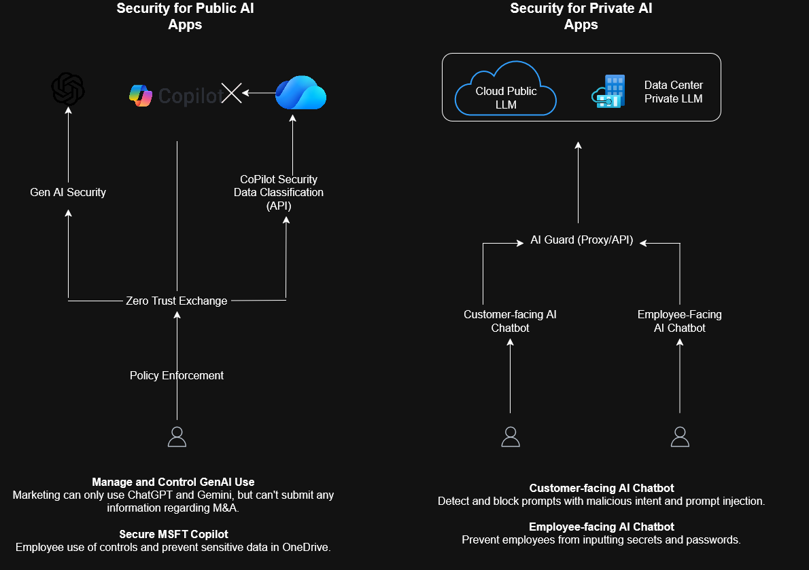

# 🔐 Protect AI Apps and LLMs with Real-Time Guardrails 🤖

## 🌍 Introduction

At the **Microsoft AI Tour 2026** in London, I attended a fascinating session titled **“Protect AI Apps and LLMs with Real-Time Guardrails”** hosted by experts from **Zscaler**.

The session emphasized the urgent need for robust security measures to safeguard AI applications and Large Language Models (LLMs). What stood out was how the speakers moved from theory to live demonstrations, clearly showing how concepts translate into real-world protection.

---

## 🎯 Key Takeaways

Here are a few insights that really stuck with me:

1. **There’s No True “Delete” Button**
   Once data is submitted to an LLM or agentic app, it can be absorbed, reused, and remembered. Even if you think it’s gone, the model may retain knowledge.

2. **Data Exists at Runtime**
   The old notions of data being “at rest” or “in transit” aren’t enough. In AI apps, data is actively processed **at runtime**, creating new security considerations.

3. **The Blast Radius Expands**
   When model knowledge, enterprise data, and user input are combined in a single pipeline, the potential impact of a compromise—its “blast radius”—increases significantly.

4. **Security Differs for Public vs. Private AI Apps**
   Protecting AI tools depends on their context. Public-facing AI apps have different risks than internal, private AI systems.

---

## 🚨 The Core Problem

As cybersecurity professionals, we face a new reality: AI apps and LLMs are becoming integral to both work and daily life—for better **and** worse.

Access to sensitive data is no longer controlled solely by humans, machines, or deterministic systems. Non-deterministic AI apps now interact with enterprise data **in real-time**, creating a new attack surface.

Users engaging with AI apps can inadvertently expose information spanning enterprise data, model knowledge, and even the internet. Questions can range from business-critical queries to personal ones. How can organizations protect both users and sensitive information?

---

## 🛡️ Practical Solutions: Core-Up Security

Security needs to be applied from the **source upward**, covering multiple layers:

1. **Encryption** – Ensure data is encrypted at rest and in transit.
2. **Access Control** – Ensure only authorized users and apps can access sensitive data.
3. **Data Loss Prevention (DLP)** – Prevent accidental or malicious data leakage.
4. **Content Moderation** – Enforce policies around:
   * Off-topic or irrelevant responses
   * Toxicity and harmful content
   * Competitive intelligence
   * Brand reputation risks
4. **Cybersecurity Measures** – Protect AI systems from:
   * Jailbreak attempts
   * Malicious links or prompts
   * Supply Chain Attacks

---

This approach ensures organizations can leverage AI and LLMs safely without exposing themselves to unforeseen risks, all while maintaining a seamless user experience.

