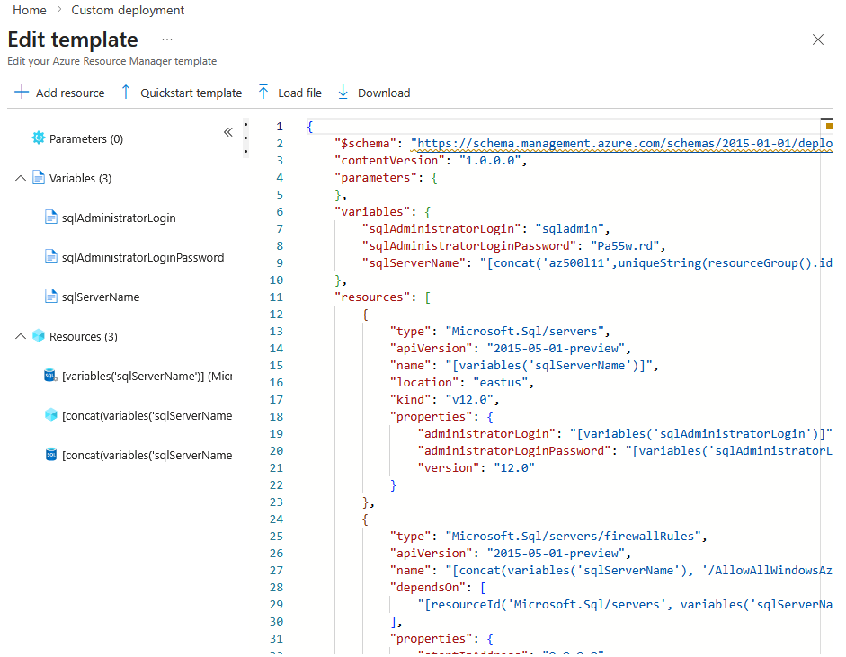
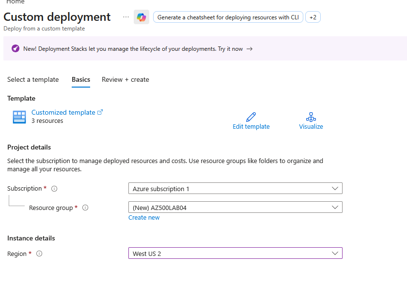
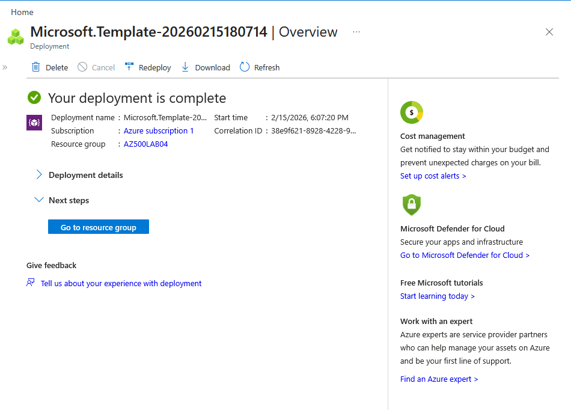
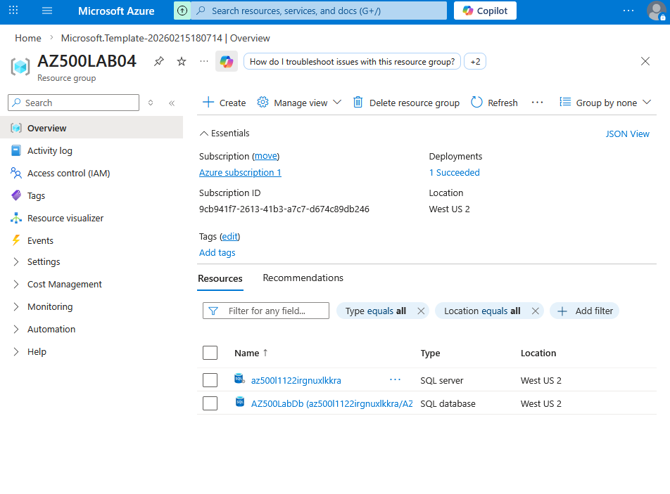
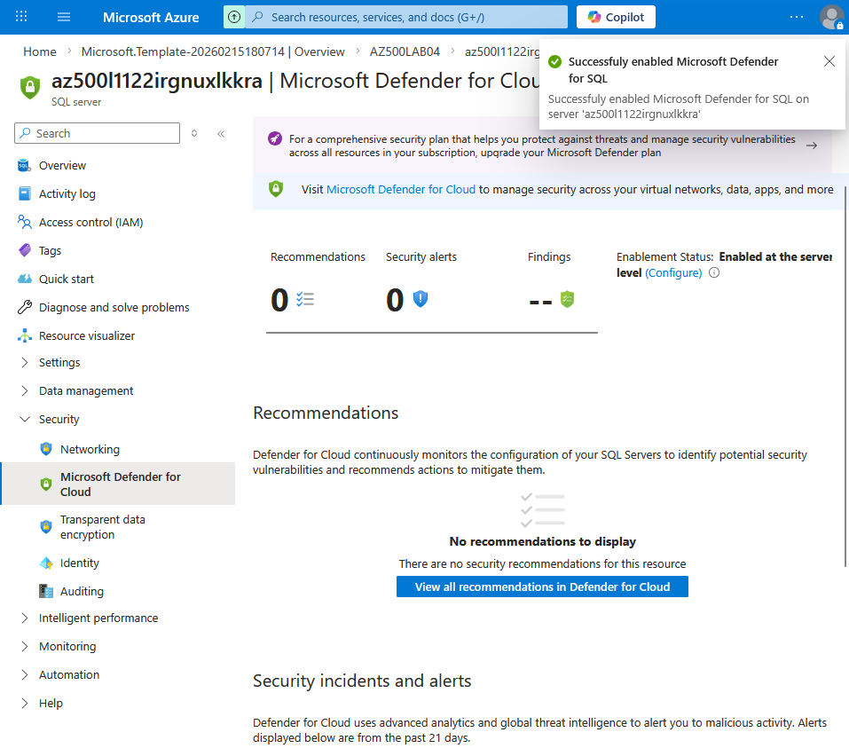
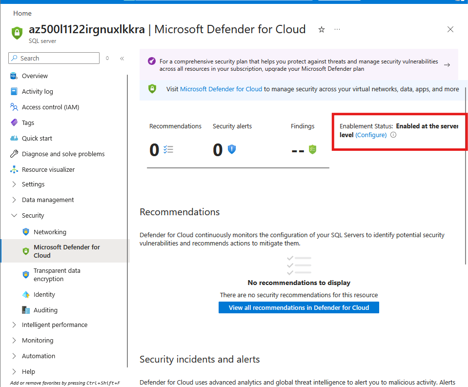
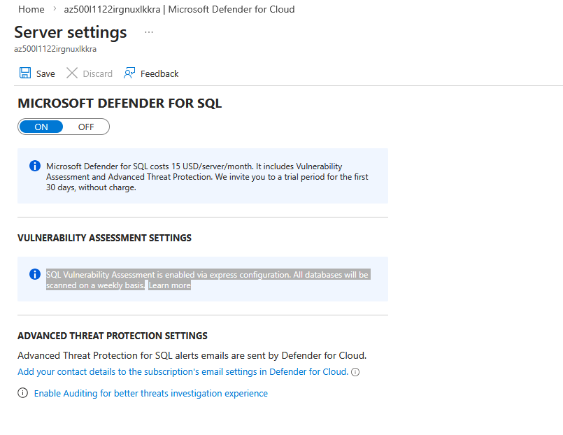
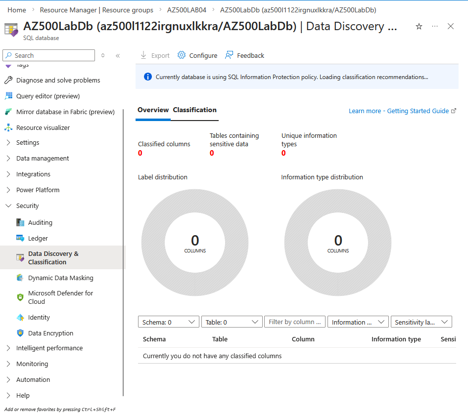

# 🔐 Lab: Securing Azure SQL Database

### CCSP Domain:

#### 🔑 D2. Cloud Data Security

---

## 📚 Lab Navigation

### 🔎 Overview

* [Lab Scenario](#lab-scenario)
* [Lab Objectives](#lab-objectives)
* [Azure SQL Security Architecture Diagram](#azure-sql-security-architecture-diagram)
* [Task 1: Deploy SQL Environment (ARM Template)](#task-1-deploy-the-azure-sql-environment-using-arm-template)
* [Task 2: Enable Microsoft Defender for SQL](#task-2-enable-microsoft-defender-for-sql-advanced-data-protection)
* [Task 3: Configure Data Discovery & Classification](#task-3-configure-data-discovery--classification)
* [Task 4: Configure Server-Level Auditing](#task-4-configure-server-level-auditing)
* [Task 5: Configure Database-Level Auditing](#task-5-configure-database-level-auditing)
* [Test Auditing (Failed & Successful Login)](#test-auditing)
* [View Audit Logs – Query Editor](#-query-editor-to-view-logs)
* [View Audit Logs – Auditing Blade](#-view-audit-logs)
* [View Audit Logs – Storage Account](#-storage-account-to-view-logs)
* [Clean Up Resources](#clean-up-resources)
* [Lesson Learnt and Improvement](#lesson-learnt-and-improvement)

---

## Lab Scenario

You have been asked to evaluate and implement security protections for **Azure SQL Database**.

Your organization wants protection against:

* SQL injection attacks
* Data exfiltration attempts
* Unauthorized query activity
* Sensitive data exposure

Additionally, you must:

* Discover and classify sensitive data (e.g., Confidential, GDPR-related)
* Enable advanced threat detection
* Configure auditing for server and database activity

> ⚠️ All resources in this lab must be deployed in **West US 2**

---

## Lab Objectives

In this lab, you will:

### Exercise 1:

Deploy and configure Azure SQL Database security features including:

* Microsoft Defender for SQL
* Data Discovery & Classification
* Server-level auditing
* Database-level auditing

---

## Azure SQL Security Architecture Diagram


---

# Instructions

---

# Exercise 1: Implement SQL Database Security Features

**Estimated Time: 30 minutes**

---

## Task 1: Deploy the Azure SQL Environment Using ARM Template

You will deploy the SQL infrastructure using a provided ARM template.

### Step 1: Sign in

Go to:

```
https://portal.azure.com
```

Sign in with an account that has **Owner** or **Contributor** role.

---

### Step 2: Deploy Template

1. Search for **Deploy a custom template**
2. Click **Build your own template in the editor**
3. Click **Load file**
4. Upload:

```json
{
    "$schema": "https://schema.management.azure.com/schemas/2015-01-01/deploymentTemplate.json#",
    "contentVersion": "1.0.0.0",
    "parameters": {},
    "variables": {
        "sqlAdministratorLogin": "sqladmin",
        "sqlAdministratorLoginPassword": "Pa55w.rd",
        "sqlServerName": "[concat('az500l11',uniqueString(resourceGroup().id))]"
    },
    "resources": [
        {
            "type": "Microsoft.Sql/servers",
            "apiVersion": "2015-05-01-preview",
            "name": "[variables('sqlServerName')]",
            "location": "westus2",
            "kind": "v12.0",
            "properties": {
                "administratorLogin": "[variables('sqlAdministratorLogin')]",
                "administratorLoginPassword": "[variables('sqlAdministratorLoginPassword')]",
                "version": "12.0"
            }
        },
        {
            "type": "Microsoft.Sql/servers/firewallRules",
            "apiVersion": "2015-05-01-preview",
            "name": "[concat(variables('sqlServerName'), '/AllowAllWindowsAzureIps')]",
            "dependsOn": [
                "[resourceId('Microsoft.Sql/servers', variables('sqlServerName'))]"
            ],
            "properties": {
                "startIpAddress": "0.0.0.0",
                "endIpAddress": "0.0.0.0"
            }
        },
        {
            "type": "Microsoft.Sql/servers/databases",
            "apiVersion": "2017-03-01-preview",
            "name": "[concat(variables('sqlServerName'), '/AZ500LabDb')]",
            "location": "westus2",
            "dependsOn": [
                "[resourceId('Microsoft.Sql/servers', variables('sqlServerName'))]"
            ],
            "sku": {
                "name": "Basic",
                "tier": "Basic"
            },
            "kind": "v12.0,user",
            "properties": {
                "collation": "SQL_Latin1_General_CP1_CI_AS",
                "maxSizeBytes": 2147483648,
                "catalogCollation": "SQL_Latin1_General_CP1_CI_AS",
                "zoneRedundant": false,
                "sampleName": "AdventureWorksLT"
            }
        }
    ]
}

```

> This template deploys an Azure SQL Server and a database.

Click **Save**





---

### Step 3: Configure Deployment Settings

| Setting        | Value                     |
| -------------- | ------------------------- |
| Resource group | `AZ500LAB04` (Create new) |
| Region         | West US 2              |
| Subscription   | Your lab subscription     |

Click **Review + Create** → **Create**

⏳ Wait for deployment to complete.










---

## Task 2: Enable Microsoft Defender for SQL (Advanced Data Protection)

We will now enable threat detection and vulnerability assessment.

1. Navigate to **Resource Groups**
2. Open **AZ500LAB04**
3. Select the newly created **SQL Server**

Under **Security**, select:

### ➜ Microsoft Defender for Cloud

Enable:

```
Microsoft Defender for SQL
```

Wait for confirmation.





---

### Review Server Settings

Click **Configure** under:

```
Microsoft Defender for SQL: Enabled at the subscription-level
```

Review:

* Pricing tier
* Vulnerability Assessment
* Advanced Threat Protection settings






---

### What This Enables

Microsoft Defender for SQL provides:

* Detection of SQL injection attacks
* Suspicious login detection
* Data exfiltration alerts
* Security recommendations
* Vulnerability assessments

> It may take 10–15 minutes for recommendations to appear.

---

## Task 3: Configure Data Discovery & Classification

We will now classify sensitive data for GDPR compliance.

1. On the SQL Server blade → Click **SQL Databases**
2. Select the database: `AZ500LabDb`
3. Under **Security**, select:

### ➜ Data Discovery & Classification

Go to the **Classification** tab.

You should see:

> “We have found 15 columns with classification recommendations”

Click the blue notification bar.




---

### Accept Recommendations

1. Review suggested classifications
2. Select **Select all**
3. Click **Accept Selected Recommendations**
4. Click **Save**

This permanently applies:

* Information types
* Sensitivity labels
* Metadata classification

### Apply Classification ####

- Observe the **Classification** for the different columns in the table

- Apply the classification to the columns in the case, changing the columns:
   - `FirstName`
   - `LastName`

- from **Confidential** to **High Confidential - GDPR**


---

### Result

The Overview tab now reflects:

* Classified columns
* Sensitivity summary
* Compliance visibility

This supports:

* GDPR
* Regulatory audits
* Data governance


---

## Task 4: Configure Server-Level Auditing

We now enable logging of:

* Successful logins
* Failed logins
* Queries
* Stored procedures

---

### Step 1: Enable Server Auditing

1. Go back to the SQL Server blade
2. Under **Security**, select **Auditing**
3. Set:

```
Enable Azure SQL Auditing → ON
```


---

### Step 2: Configure Storage

Select:

☑ Storage

Click **Create new** storage account.

Requirements:

* Globally unique name
* 3–24 lowercase letters and digits
* Same region (East US)


### Troubleshooting

- If you get an error `Mircosoft Insights` 

1. Go to `Azure Portal``
2. Search for `Subscriptions`
3. Select your subscription
4. In the left menu, select `Resource Providers`
5. Search for `Microsoft.Insights`
6. Click `Register`
7. Wait for registration to complete


---

### Step 3: Set Retention

Under **Advanced properties**:

```
Retention (days): 5
```

Click **Save**

> If storage is not immediately available, wait a few minutes and retry.


---

## Task 5: Configure Database-Level Auditing

1. Navigate to:
   SQL Server → SQL Databases → `AZ500LabDb`
2. Under **Security**, click **Auditing**

You’ll notice:

* Server-level auditing already applies
* You can additionally configure:

  * Storage
  * Log Analytics
  * Event Hub


Perfect — here’s a tighter, cleaner version for quick revision:

---

### 🔎 SQL Server vs Database-Level Auditing

If **server-level storage auditing** is enabled, it applies to **all databases**, regardless of database settings.

#### When to Use Database-Level Auditing Only

* **Granularity** – Audit only specific sensitive databases
* **Custom rules** – Different audit actions per database (e.g., SELECT on one DB only)

### 🎯 Real-World Best Practice

In production:

* ✅ Enable **server-level auditing**
* ✅ Send logs to **central storage or Log Analytics**
* ✅ Avoid per-database storage configs

It’s simpler, more consistent, and more compliant.


---

### Test Auditing

1. Open the database **Overview**
2. Select **Query editor (preview)**
3. Attempt:

   * Failed login
   * Successful login
   * Run a sample query

Everything will be logged.


#### Failed login

Try one of these:
   * Use the wrong password
   * Or if it says your IP isn’t allowed, don’t add the firewall rule yet
You might see:
   * Login failed
   * Client IP not allowed

👉 Good. That’s what we want.
Even failed logins get audited.


### Successful login


Now:
   1. Fix the issue
      ○ Use correct password
      ○ Click “Add your client IP” if firewall blocks you
   2. Sign in successfully
Now you’ve generated:
   * A failed authentication event
   * A successful authentication event
Both are recorded in audit logs.


---

### 🔍 View Audit Logs

* Different ways to view audit logs:
   * **Query Editor**
   * **View Auditing Logs**
   * **Storage Account**


Example of what you should see:
* **Login attempts**
* **Query activity**
* **Event timestamps**


## 🧩 Query Editor to View Logs

1. Go to your SQL database
2. Click Query editor (preview) on the left
Now Azure will ask you to sign in.


```sql
SELECT name FROM sys.tables;

```


## 📊 View Auditing Logs in SQL Database

1. Return to **Auditing**
2. Click **View Audit Logs**
3. Switch between:
   * Server audit
   * Database audit


 


#### Failed login

 


#### Successful login


 


## 🪣Storage Account to View Logs

The SQL Server sends audit logs to the Storage Account configured earlier
(e.g., `dbauditingcprbn123server`).

To view the logs:

1. Go to the **Storage Account** in the Azure Portal
2. Select **Containers**
3. Locate the container named similar to: `sqldbauditlogs`
4. Open the container — you will see audit files in **.xel** or **.json** format

Download one of the files and open it in a text editor to review the audit events.


---

# Result

You have successfully:

* Deployed Azure SQL Server and database
* Enabled Microsoft Defender for SQL
* Classified sensitive data
* Configured server-level auditing
* Configured database-level auditing
* Validated audit log collection

Your SQL environment is now significantly more secure and compliant-ready.

---

# Clean Up Resources

To avoid unexpected costs:

Open **Cloud Shell (PowerShell)** and run:

```powershell
Remove-AzResourceGroup -Name "AZ500LAB04" -Force -AsJob
```

Confirm deletion in the portal.


---

# Lesson Learnt and Improvement

🔐 **Defender for SQL is proactive security**
It detects threats before data is compromised.

🏷️ **Data classification is foundational**
You cannot protect what you don’t identify.

📊 **Auditing provides accountability**
Every login and query becomes traceable.

🛡️ **Defense-in-depth matters**

| Layer          | Protection Type        |
| -------------- | ---------------------- |
| Defender       | Threat detection       |
| Classification | Data governance        |
| Auditing       | Forensics & compliance |

---

## Key Takeaway

Azure SQL security is not a single setting — it is a layered model:

* Prevent
* Detect
* Classify
* Audit

When combined, these controls significantly reduce risk of data breaches and regulatory violations.

