# 🐳🔐 Lab 04: Configuring and Securing ACR and AKS

### CCSP Domain:

#### ☁️ D4. Cloud Application Security

---

## 📚 Lab Navigatissson

### 🔎 Overview

* [Lab Scenario](#lab-scenario)
* [Lab Objectives](#lab-objectives)
* [ACR & AKS Architecture Diagram](#acr--aks-architecture-diagram)
* [Task 1: Create Azure Container Registry](#task-1-create-an-azure-container-registry)
* [Task 2: Build and Push Docker Image](#task-2-create-a-dockerfile-build-and-push-container-image)
* [Task 3: Create Azure Kubernetes Service Cluster](#task-3-create-an-azure-kubernetes-service-cluster)
* [Task 4: Grant AKS Access to ACR](#task-4-grant-aks-permissions-to-access-acr)
* [Task 5: Deploy External Service](#task-5-deploy-an-external-service-to-aks)
* [Task 6: Verify External Access](#task-6-verify-external-service-access)
* [Task 7: Deploy Internal Service](#task-7-deploy-an-internal-service-to-aks)
* [Task 8: Verify Internal Access](#task-8-verify-internal-service-access)
* [Clean Up Resources](#clean-up-resources)
* [Lessons Learned](#lessons-learned)

---

# Lab Scenario

You have been asked to deploy a proof of concept using:

* **Azure Container Registry (ACR)**
* **Azure Kubernetes Service (AKS)**

The proof of concept must demonstrate:

* Building a container image using a Dockerfile
* Storing images securely in ACR
* Deploying workloads into AKS
* Securing and accessing services internally and externally

> ⚠️ All resources in this lab must be deployed in **East US 2**.


---

# Lab Objectives

## Exercise 1: Configure and Secure ACR and AKS

You will:

* Create an Azure Container Registry
* Build and push a container image
* Deploy an AKS cluster
* Grant secure access between AKS and ACR
* Deploy and validate:
  * External service
  * Internal service

---

# ACR & AKS Architecture Diagram


---

# Exercise 1: Configuring and Securing ACR and AKS

**Estimated Time: 45 Minutes**

---

## Task 1: Create an Azure Container Registry

### Step 1: Sign in

Go to:

```
https://portal.azure.com
```

Sign in using an account with:

* **Owner or Contributor** role
* **Global Administrator** role in Microsoft Entra ID

---

### Step 2: Open Cloud Shell (Bash)

Click the Cloud Shell icon → Select:

* Bash
* No storage account required
* Select your subscription

---

### Step 3: Create Resource Group

```bash
az group create --name AZ500LAB05 --location eastus
```

Verify:

```bash
az group list --query "[?name=='AZ500LAB05']" -o table
```

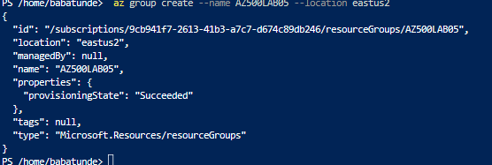


---

### Step 4: Register Required Providers

```bash
az provider register --namespace Microsoft.Kubernetes
az provider register --namespace Microsoft.KubernetesConfiguration
az provider register --namespace Microsoft.OperationsManagement
az provider register --namespace Microsoft.OperationalInsights
az provider register --namespace Microsoft.ContainerService
az provider register --namespace Microsoft.ContainerRegistry
```


---

### Step 5: Create Azure Container Registry

> ⚠️ ACR name must be globally unique.

```bash
az acr create --resource-group AZ500LAB05 --name az500$(Get-Random) --sku Standard

```
Verify:

```bash
az acr list --resource-group AZ500LAB05 -o table
```


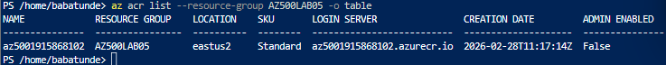

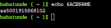


📝 Record the ACR name for later use.

---

## Task 2: Build and Push Container Image

---

### Step 1: Build and Push Image to ACR

```bash
ACRNAME=$(az acr list --resource-group AZ500LAB05 --query '[].{Name:name}' --output tsv)

az acr import --name $ACRNAME --source docker.io/library/nginx:latest --image sample/nginx:v1


```

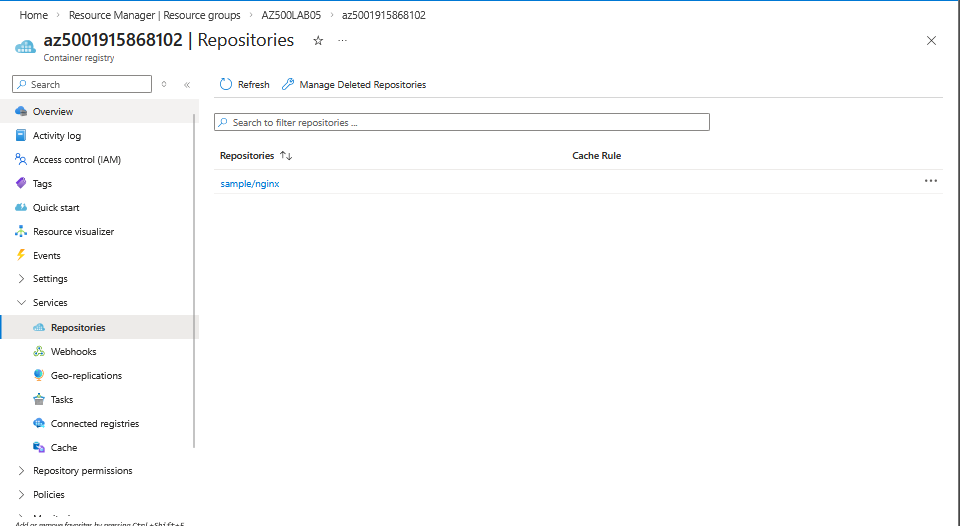


⏳ Wait for completion (~2 minutes).

---

### Step 3: Verify in Azure Portal

Navigate to:

* Resource Group → AZ500LAB05
* Open Container Registry
* Select **Repositories**

Confirm:

* Repository: `sample/nginx`
* Tag: `v1`


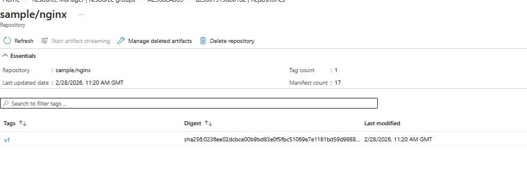

---

## Task 3: Create an Azure Kubernetes Service Cluster

Search for:

```
Kubernetes services
```

Click:

```
Create → Create Kubernetes cluster
```

---

### Basics Tab Configuration

| Setting        | Value                               |
| -------------- | ----------------------------------- |
| Resource Group | AZ500LAB05                          |
| Cluster Name   | MyKubernetesCluster                 |
| Region         | East US                             |
| Pricing Tier   | Free                                |
| Authentication | Local accounts with Kubernetes RBAC |

Click **Next**

---

### Node Pools

* Disable auto-provisioning
* Disable virtual nodes
* Accept VM size recommendation

---

### Networking

| Setting           | Value    |
| ----------------- | -------- |
| Private Cluster   | Disabled |
| Azure CNI Overlay | Enabled  |
| Network Policy    | None     |

Click **Review + Create** → **Create**

⏳ Deployment may take 10 minutes.


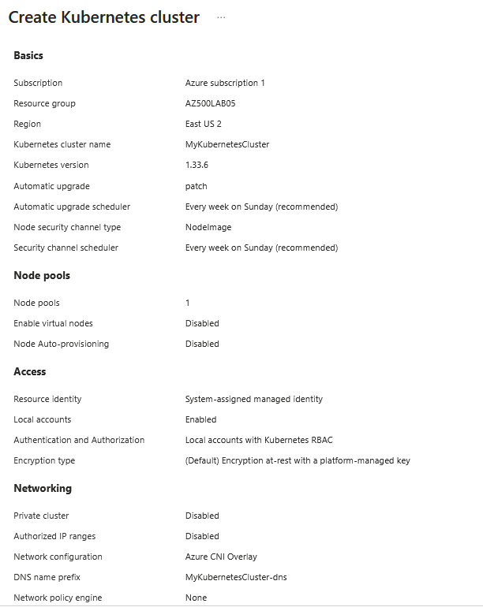

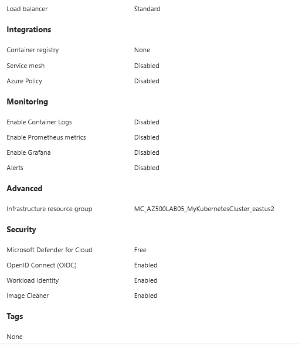


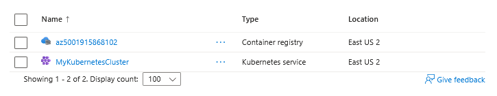


---

### Connect to AKS

In Cloud Shell:

```bash
az aks get-credentials --resource-group AZ500LAB05 --name MyKubernetesCluster
```

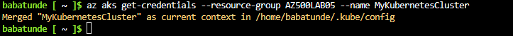

Verify:

```bash
kubectl get nodes
```

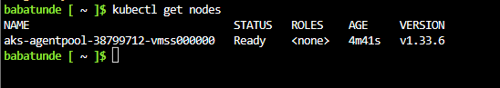


Ensure node status is **Ready**.

---

## Task 4: Grant AKS Permissions to Access ACR

Attach ACR:

```bash
ACRNAME=$(az acr list --resource-group AZ500LAB05 --query '[].{Name:name}' --output tsv)

az aks update -n MyKubernetesCluster -g AZ500LAB05 --attach-acr $ACRNAME
```
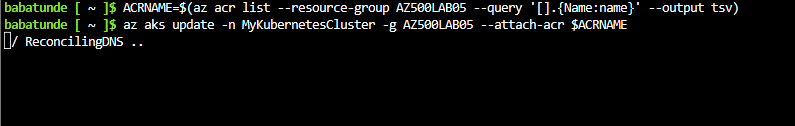

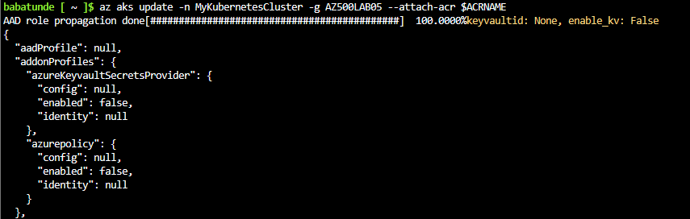

---

### Grant Contributor Role to AKS on VNet

```bash
RG_AKS=AZ500LAB05
RG_VNET=MC_AZ500LAB05_MyKubernetesCluster_eastus
AKS_CLUSTER_NAME=MyKubernetesCluster

AKS_VNET_NAME=$(az network vnet list --resource-group $RG_VNET --query "[0].name" -o tsv)

AKS_VNET_ID=$(az network vnet show --name $AKS_VNET_NAME --resource-group $RG_VNET --query id -o tsv)

AKS_MANAGED_ID=$(az aks show --name $AKS_CLUSTER_NAME --resource-group $RG_AKS --query identity.principalId -o tsv)

az role assignment create --assignee $AKS_MANAGED_ID --role Contributor --scope $AKS_VNET_ID
```

---

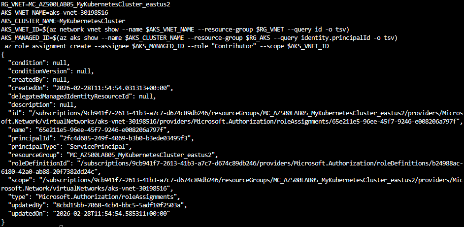


## Task 5: Deploy an External Service to AKS

Upload:

* `nginxexternal.yaml`
* `nginxinternal.yaml`


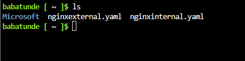

Edit `nginxexternal.yaml`:

Replace:

```
<ACRUniquename>
```

With your ACR name.


Apply:

```bash
kubectl apply -f nginxexternal.yaml
```

Verify:

```bash
kubectl get service nginxexternal
```

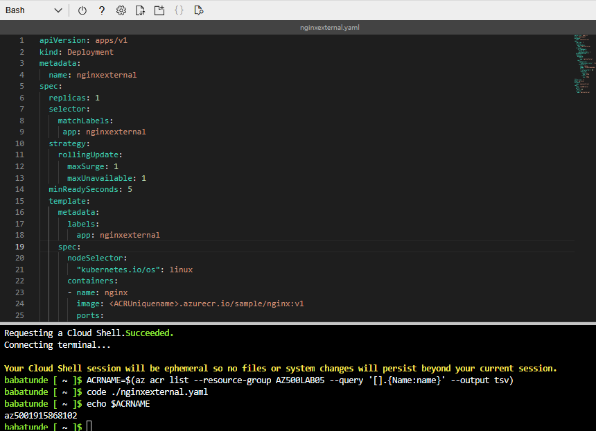

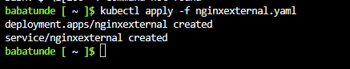


---

## Task 6: Verify External Service Access

Retrieve External IP:

```bash
kubectl get service nginxexternal
```

Copy the **External-IP** and browse to:

```
http://<External-IP>
```

You should see:

```
Welcome to nginx!
```

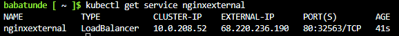

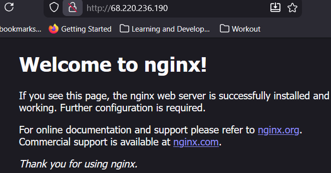

---

## Task 7: Deploy an Internal Service to AKS

Edit:

```
nginxinternal.yaml
```

Replace `<ACRUniquename>` with your ACR name.


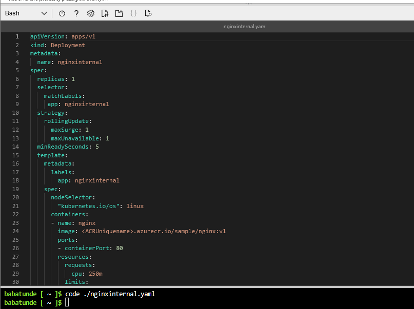


Apply:

```bash
kubectl apply -f nginxinternal.yaml
```

Verify:

```bash
kubectl get service nginxinternal
```

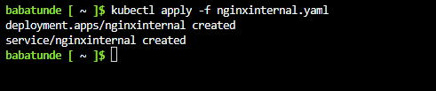

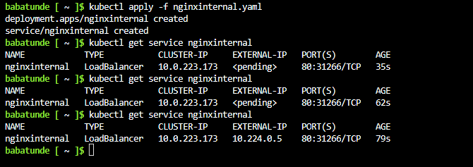


Note:

* External-IP will be private.

---

## Task 8: Verify Internal Service Access

List pods:

```bash
kubectl get pods
```

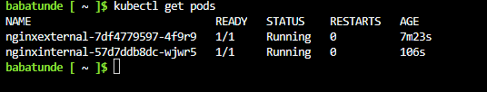

Connect to first pod:

```bash
kubectl exec -it <pod_name> -- /bin/bash
```

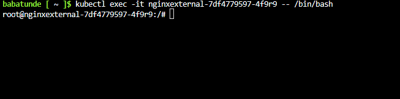

Test internal endpoint:

```bash
curl http://<internal_IP>
```

You should see the nginx HTML output.

Exit and close Cloud Shell.


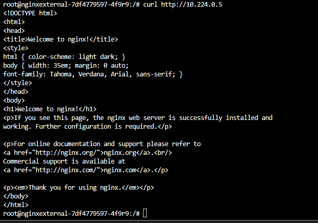


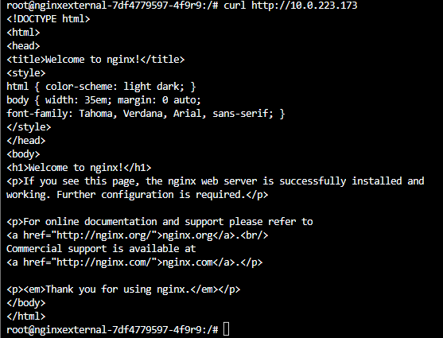

---

# ✅ Result

You have successfully:

* Built and pushed container images to ACR
* Deployed and configured AKS
* Granted secure access between AKS and ACR
* Deployed external and internal services
* Validated secure service communication

---

# Clean Up Resources

To avoid unexpected costs:

Open Cloud Shell → Switch to PowerShell

```powershell
Remove-AzResourceGroup -Name "AZ500LAB05" -Force -AsJob
```


Confirm deletion in the Azure portal.

---

# Lessons Learned

🐳 **Containers are portable — security must follow them**

🔐 **ACR + AKS integration requires explicit role assignment**

🌐 **External services use public load balancers**

🏢 **Internal services rely on private networking**

---

## Defense-in-Depth in Container Platforms

| Layer             | Protection           |
| ----------------- | -------------------- |
| ACR               | Secure image storage |
| AKS RBAC          | Access control       |
| VNet              | Network isolation    |
| Internal Services | Reduced exposure     |

---

## 🎯 Key Takeaway

Container security in Azure is not just about running workloads.

It’s about:

* Securing images
* Controlling access
* Managing network boundaries
* Validating connectivity

When combined, these controls create a secure and production-ready container platform.
