# 🌐🔐 Lab 07: Azure Key Vault and Always Encrypted for SQL Database

### CCSP Domain:

#### ☁️ D3. Cloud Platform & Infrastructure Security

#### 🔑 D5. Cloud Security Operations

---

# 📚 Lab Navigation

### 🔎 Overview

* [Lab Scenario](#lab-scenario)
* [Lab Objectives](#lab-objectives)
* [Architecture Diagram](#architecture-diagram)
* [Exercise 1: Deploy Base Infrastructure](#exercise-1-deploy-the-base-infrastructure-from-an-arm-template)
* [Exercise 2: Configure Azure Key Vault](#exercise-2-configure-the-key-vault-resource-with-a-key-and-a-secret)
* [Exercise 3: Configure Azure SQL Database and Application](#exercise-3-configure-an-azure-sql-database-and-a-data-driven-application)
* [Exercise 4: Demonstrate Always Encrypted with Key Vault](#exercise-4-demonstrate-the-use-of-azure-key-vault-in-encrypting-the-azure-sql-database)
* [Clean Up Resources](#clean-up-resources)
* [Lessons Learned](#lessons-learned)

---

# Lab Scenario

You have been asked to create a **proof of concept** demonstrating how to secure sensitive database data using **Azure SQL Database Always Encrypted** with **Azure Key Vault**.

The goal is to protect highly sensitive information (such as patient records) so that:

* Encryption keys are securely stored in **Azure Key Vault**
* Sensitive database columns are encrypted using **Always Encrypted**
* Applications authenticate securely using **Microsoft Entra ID**

This proof-of-concept includes:

* Creating an **Azure Key Vault** to store keys and secrets
* Deploying **Azure SQL Database**
* Encrypting database columns using **Always Encrypted**
* Accessing encrypted data securely via a **client application**


---

# Lab Objectives

In this lab you will complete the following exercises:

| Exercise       | Description                                         |
| -------------- | --------------------------------------------------- |
| **Exercise 1** | Deploy base infrastructure using an ARM template    |
| **Exercise 2** | Configure Azure Key Vault with keys and secrets     |
| **Exercise 3** | Configure Azure SQL Database and application access |
| **Exercise 4** | Demonstrate Always Encrypted with Azure Key Vault   |

**Estimated Lab Time:** 60 minutes

---

# Architecture Diagram


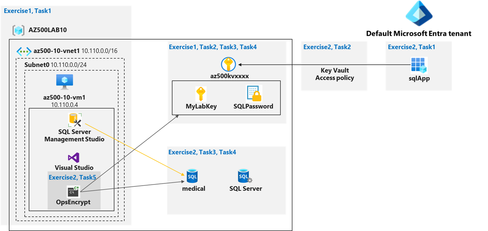


This lab demonstrates the relationship between:

* **Azure Key Vault**
* **Azure SQL Database**
* **Microsoft Entra ID Application**
* **Client Application (Visual Studio Console App)**

**Security Flow**

1. Client application authenticates with **Microsoft Entra ID**
2. Application retrieves encryption key from **Azure Key Vault**
3. SQL Database encrypts sensitive columns using **Always Encrypted**
4. Authorized applications decrypt data securely

---

# Exercise 1: Deploy the base infrastructure from an ARM template

**Goal:** Deploy a Virtual Machine and Azure SQL Database required for the lab.

---

## Task 1: Deploy an Azure VM and Azure SQL Database

The ARM template automatically deploys:

* Azure Virtual Machine
* Visual Studio
* SQL Server Management Studio
* Azure SQL Database

### Steps

1. Sign in to the Azure portal
   [https://portal.azure.com/](https://portal.azure.com/)

2. In the search bar, type:

```
Deploy a custom template
```

3. Select **Build your own template in the editor**.

4. Click **Load file** and open:

```json
{
  "$schema": "https://schema.management.azure.com/schemas/2019-04-01/deploymentTemplate.json#",
  "contentVersion": "1.0.0.0",
  "parameters": {
    "adminUsername": {
      "type": "string",
      "minLength": 1,
      "defaultValue": "Student",
      "metadata": {
        "description": "Username for the Virtual Machine."
      }
    },
    "adminPassword": {
      "type": "securestring",
      "defaultValue": "Pa55w.rd1234",
      "metadata": {
        "description": "Password for the Virtual Machine."
      }
    }
  },
  "variables": {
    "imagePublisher": "MicrosoftWindowsServer",
    "imageOffer": "WindowsServer",
    "imageSku": "2022-datacenter",
    "OSDiskName": "jumpvmosdisk",
    "nicName": "az500-10-nic1",
    "addressPrefix": "10.110.0.0/16",
    "subnetName": "subnet0",
    "subnetPrefix": "10.110.0.0/24",
    "vhdStorageType": "Premium_LRS",
    "publicIPAddressName": "az500-10-pip1",
    "publicIPAddressType": "static",
    "vhdStorageContainerName": "vhds",
    "vmName": "az500-10-vm1",
    "vmSize": "Standard_D4s_v3",
    "virtualNetworkName": "az500-10-vnet1",
    "vnetId": "[resourceId('Microsoft.Network/virtualNetworks', variables('virtualNetworkName'))]",
    "networkSecurityGroupName": "az500-10-nsg1",
    "subnetRef": "[concat(variables('vnetId'), '/subnets/', variables('subnetName'))]",
    "vhdStorageAccountName": "[concat('vhdstorage', uniqueString(resourceGroup().id))]",
    "sqlServerName": "[concat('sqlserver', uniqueString(subscription().id, resourceGroup().id))]",
    "databaseName": "medical",
    "databaseEdition": "Basic",
    "databaseCollation": "SQL_Latin1_General_CP1_CI_AS",
    "databaseServiceObjectiveName": "Basic"
  },
  "resources": [
    {
      "type": "Microsoft.Storage/storageAccounts",
      "name": "[variables('vhdStorageAccountName')]",
      "apiVersion": "2016-01-01",
      "location": "[resourceGroup().location]",
      "tags": {
        "displayName": "StorageAccount"
      },
      "sku": {
        "name": "[variables('vhdStorageType')]"
      },
      "kind": "Storage"
    },
    {
      "apiVersion": "2023-06-01",
      "type": "Microsoft.Network/publicIPAddresses",
      "name": "[variables('publicIPAddressName')]",
      "location": "[resourceGroup().location]",
      "tags": {
        "displayName": "PublicIPAddress"
      },
      "sku": {
        "name": "Standard"
      },
      "properties": {
        "publicIPAllocationMethod": "[variables('publicIPAddressType')]"
      }
    },
    {
      "apiVersion": "2016-03-30",
      "type": "Microsoft.Network/virtualNetworks",
      "name": "[variables('virtualNetworkName')]",
      "location": "[resourceGroup().location]",
      "tags": {
        "displayName": "VirtualNetwork"
      },
      "properties": {
        "addressSpace": {
          "addressPrefixes": [
            "[variables('addressPrefix')]"
          ]
        },
        "subnets": [
          {
            "name": "[variables('subnetName')]",
            "properties": {
              "addressPrefix": "[variables('subnetPrefix')]"
            }
          }
        ]
      }
    },
    {
      "apiVersion": "2016-03-30",
      "type": "Microsoft.Network/networkInterfaces",
      "name": "[variables('nicName')]",
      "location": "[resourceGroup().location]",
      "tags": {
        "displayName": "NetworkInterface"
      },
      "dependsOn": [
        "[resourceId('Microsoft.Network/publicIPAddresses', variables('publicIPAddressName'))]",
        "[resourceId('Microsoft.Network/virtualNetworks', variables('virtualNetworkName'))]"
      ],
      "properties": {
        "ipConfigurations": [
          {
            "name": "ipconfig1",
            "properties": {
              "privateIPAllocationMethod": "Dynamic",
              "publicIPAddress": {
                "id": "[resourceId('Microsoft.Network/publicIPAddresses', variables('publicIPAddressName'))]"
              },
              "subnet": {
                "id": "[variables('subnetRef')]"
              }
            }
          }
        ],
        "networkSecurityGroup": {
          "id": "[resourceId('Microsoft.Network/networkSecurityGroups', variables('networkSecurityGroupName'))]"
        }
      }
    },
    {
      "apiVersion": "2015-06-15",
      "type": "Microsoft.Compute/virtualMachines",
      "name": "[variables('vmName')]",
      "location": "[resourceGroup().location]",
      "tags": {
        "displayName": "JumpVM"
      },
      "dependsOn": [
        "[resourceId('Microsoft.Storage/storageAccounts', variables('vhdStorageAccountName'))]",
        "[resourceId('Microsoft.Network/networkInterfaces', variables('nicName'))]"
      ],
      "properties": {
        "hardwareProfile": {
          "vmSize": "[variables('vmSize')]"
        },
        "osProfile": {
          "computerName": "[variables('vmName')]",
          "adminUsername": "[parameters('adminUsername')]",
          "adminPassword": "[parameters('adminPassword')]"
        },
        "storageProfile": {
          "imageReference": {
            "publisher": "[variables('imagePublisher')]",
            "offer": "[variables('imageOffer')]",
            "sku": "[variables('imageSku')]",
            "version": "latest"
          },
          "osDisk": {
            "name": "osdisk",
            "vhd": {
              "uri": "[concat(reference(resourceId('Microsoft.Storage/storageAccounts', variables('vhdStorageAccountName')), '2016-01-01').primaryEndpoints.blob, variables('vhdStorageContainerName'), '/', variables('OSDiskName'), '.vhd')]"
            },
            "caching": "ReadWrite",
            "createOption": "FromImage"
          }
        },
        "networkProfile": {
          "networkInterfaces": [
            {
              "id": "[resourceId('Microsoft.Network/networkInterfaces', variables('nicName'))]"
            }
          ]
        },
        "diagnosticsProfile": {
          "bootDiagnostics": {
            "enabled": false
          }
        }
      },
      "resources": [
        {
          "apiVersion": "2018-06-01",
          "type": "Microsoft.Compute/virtualMachines/extensions",
          "name": "[concat(variables('vmName'), '/', 'VMConfig')]",
          "location": "[resourceGroup().location]",
          "dependsOn": [
            "[concat('Microsoft.Compute/virtualMachines/', variables('vmName'))]"
          ],
          "properties": {
            "publisher": "Microsoft.Compute",
            "type": "CustomScriptExtension",
            "typeHandlerVersion": "1.7",
            "autoUpgradeMinorVersion": true,
            "settings": {
              "fileUris": [
                "https://raw.githubusercontent.com/MicrosoftLearning/AZ500-AzureSecurityTechnologies/master/Allfiles/Labs/10/configurevm.ps1"
              ],
              "commandToExecute": "powershell.exe -ExecutionPolicy Unrestricted -File configurevm.ps1"
            }
          }
        }
      ]
    },
    {
      "name": "[variables('networkSecurityGroupName')]",
      "type": "Microsoft.Network/networkSecurityGroups",
      "apiVersion": "2018-08-01",
      "location": "[resourceGroup().location]",
      "comments": "Network Security Group (NSG) for Primary NIC",
      "properties": {
        "securityRules": [
          {
            "name": "default-allow-rdp",
            "properties": {
              "priority": 1000,
              "sourceAddressPrefix": "*",
              "protocol": "Tcp",
              "destinationPortRange": "3389",
              "access": "Allow",
              "direction": "Inbound",
              "sourcePortRange": "*",
              "destinationAddressPrefix": "*"
            }
          }
        ]
      }
    },
    {
      "name": "[variables('sqlServerName')]",
      "type": "Microsoft.Sql/servers",
      "apiVersion": "2019-06-01-preview",
      "location": "[resourceGroup().location]",
      "tags": {
        "displayName": "SqlServer"
      },
      "properties": {
        "administratorLogin": "[parameters('adminUsername')]",
        "administratorLoginPassword": "[parameters('adminPassword')]",
        "version": "12.0"
      },
      "resources": [
        {
          "name": "[variables('databaseName')]",
          "type": "databases",
          "apiVersion": "2019-06-01-preview",
          "location": "[resourceGroup().location]",
          "tags": {
            "displayName": "Database"
          },
          "sku": {
            "name": "[variables('databaseEdition')]",
            "tier": "[variables('databaseEdition')]"
          },
          "properties": {},
          "dependsOn": [
            "[variables('sqlServerName')]"
          ]
        },
        {
          "name": "AllowAllMicrosoftAzureIps",
          "type": "firewallrules",
          "apiVersion": "2015-05-01-preview",
          "location": "[resourceGroup().location]",
          "properties": {
            "startIpAddress": "0.0.0.0",
            "endIpAddress": "0.0.0.0"
          },
          "dependsOn": [
            "[variables('sqlServerName')]"
          ]
        }
      ]
    }
  ],
  "outputs": {}
}

```

5. Click **Save**.

6. Configure the deployment:

| Setting        | Value                       |
| -------------- | --------------------------- |
| Subscription   | Your Azure subscription     |
| Resource group | **AZ500Lab10** (Create new) |
| Location       | **East US**                 |
| Username       | Student                     |
| Password       | Your lab password           |

7. Click **Review + Create**.

8. Click **Create** to start the deployment.

> ⏳ Deployment may take **20–25 minutes**. Continue with the next exercise while it runs.


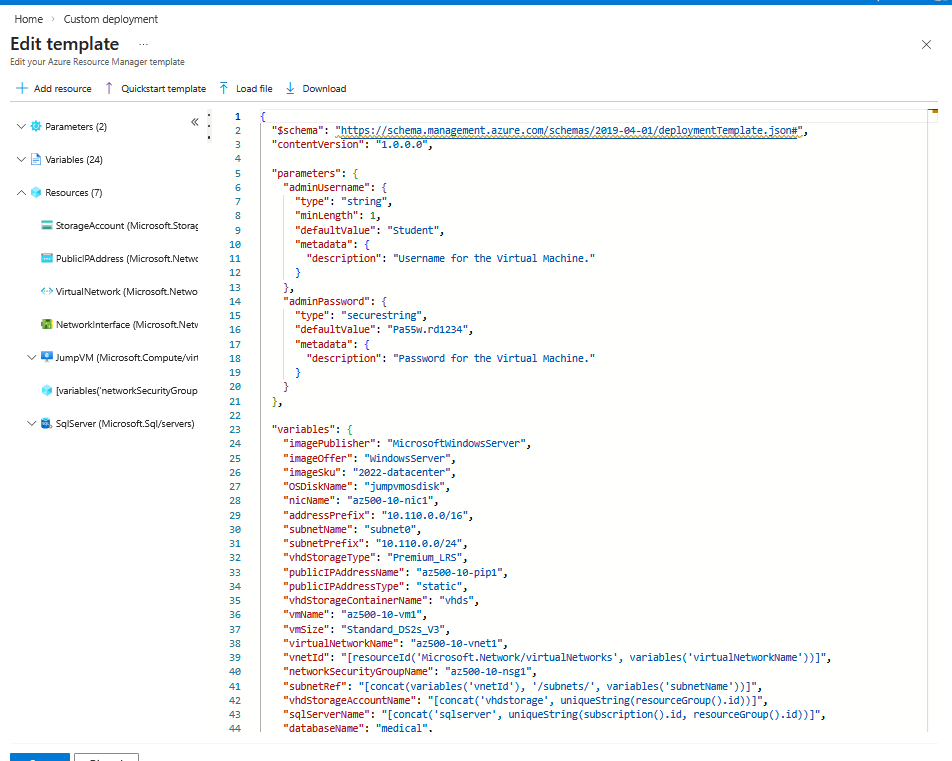

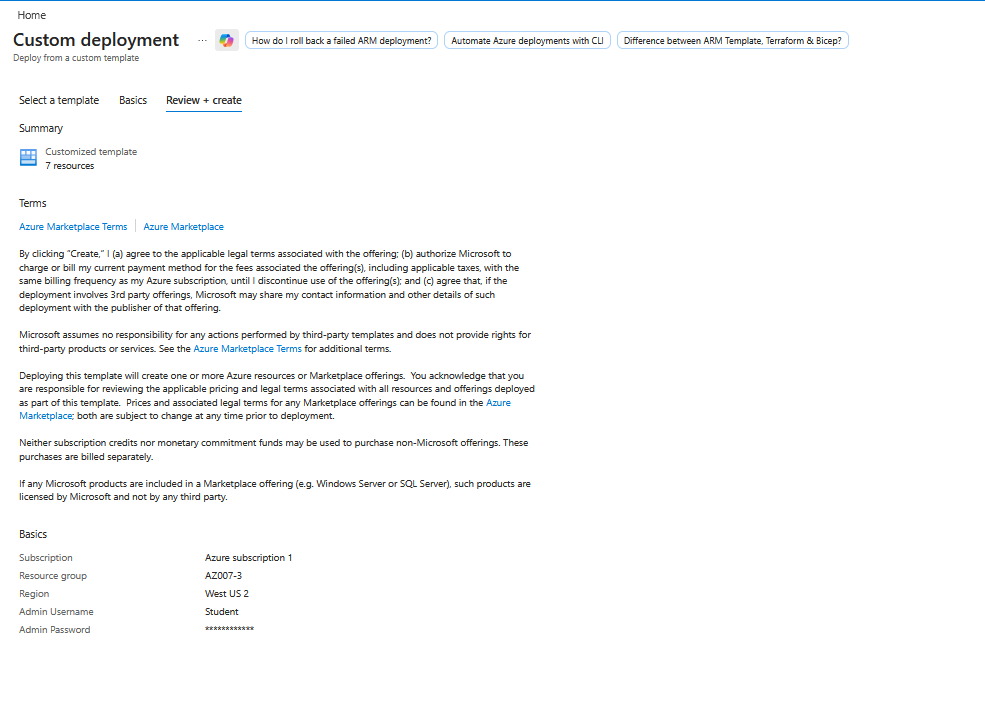


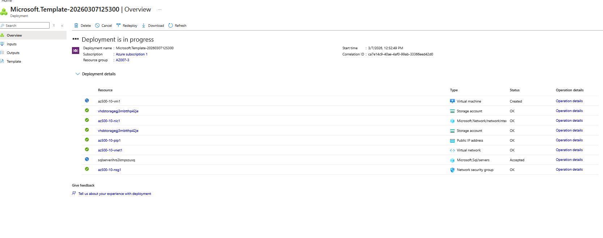

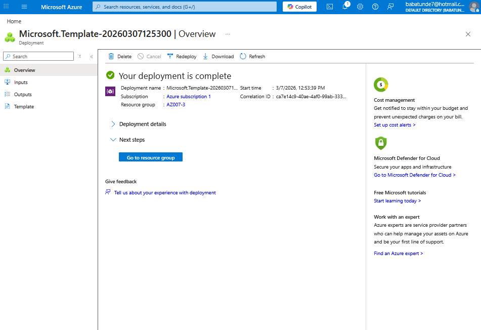


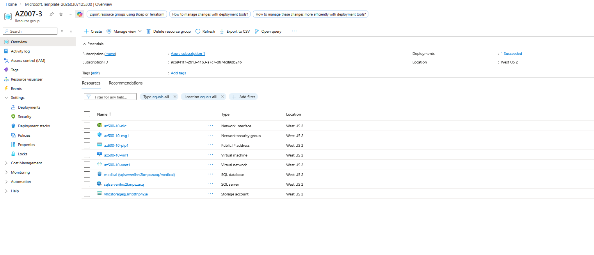

---

## Install the Database Template

Repeat the process to deploy the database configuration template.

1. Search **Deploy a custom template** again.
2. Select **Build your own template in the editor**.
3. Load file:

```json
{
  "$schema": "https://schema.management.azure.com/schemas/2019-04-01/deploymentTemplate.json#",
  "contentVersion": "1.0.0.0",
  "parameters": {
    "adminUsername": {
      "type": "string",
      "defaultValue": "Student",
      "metadata": {
        "description": "Administrador de SQL Server."
      }
    },
    "adminPassword": {
      "type": "securestring",
      "defaultValue": "Pa55w.rd1234",
      "metadata": {
        "description": "Contraseña del administrador de SQL Server."
      }
    }
  },
  "variables": {
    "sqlServerName": "[concat('sqlserver', uniqueString(subscription().id, resourceGroup().id))]",
    "databaseName": "medical",
    "databaseEdition": "Basic"
  },
  "resources": [
    {
      "type": "Microsoft.Sql/servers",
      "apiVersion": "2019-06-01-preview",
      "name": "[variables('sqlServerName')]",
      "location": "[resourceGroup().location]",
      "properties": {
        "administratorLogin": "[parameters('adminUsername')]",
        "administratorLoginPassword": "[parameters('adminPassword')]",
        "version": "12.0"
      },
      "resources": [
        {
          "type": "databases",
          "apiVersion": "2019-06-01-preview",
          "name": "[variables('databaseName')]",
          "location": "[resourceGroup().location]",
          "sku": {
            "name": "[variables('databaseEdition')]",
            "tier": "[variables('databaseEdition')]"
          },
          "properties": {},
          "dependsOn": [
            "[resourceId('Microsoft.Sql/servers', variables('sqlServerName'))]"
          ]
        },
        {
          "type": "firewallRules",
          "apiVersion": "2015-05-01-preview",
          "name": "AllowAllMicrosoftAzureIps",
          "location": "[resourceGroup().location]",
          "properties": {
            "startIpAddress": "0.0.0.0",
            "endIpAddress": "0.0.0.0"
          },
          "dependsOn": [
            "[resourceId('Microsoft.Sql/servers', variables('sqlServerName'))]"
          ]
        }
      ]
    }
  ],
  "outputs": {}
}

```

4. Select the same **Resource Group**.
5. Enter the **same Admin Password**.
6. Click **Review + Create → Create**.

---

# Exercise 2: Configure the Key Vault resource with a key and a secret

You will now create and configure **Azure Key Vault** to securely store cryptographic keys and secrets.

---

## Task 1: Create and configure a Key Vault

1. Open **Cloud Shell** in the Azure Portal.
2. Select **PowerShell**.

Run:

```powershell
$kvName = 'az500kv' + $(Get-Random)

$location = (Get-AzResourceGroup -ResourceGroupName 'AZ500Lab10').Location

New-AzKeyVault `
 -VaultName $kvName `
 -ResourceGroupName 'AZ500Lab10' `
 -Location $location `
 -DisableRbacAuthorization
```

Take note of:

* **Vault Name**
* **Vault URI**

Example:

```
https://<vault-name>.vault.azure.net/
```

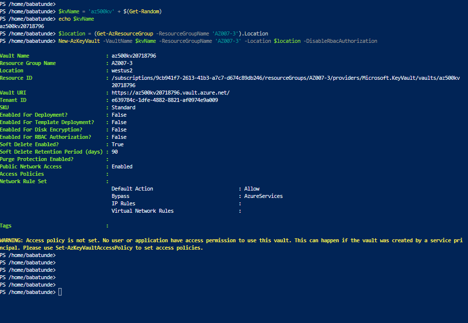

* **Vault Name Example:** az500kv20718796

* **Vault URI Example:** https://az500kv20718796.vault.azure.net/


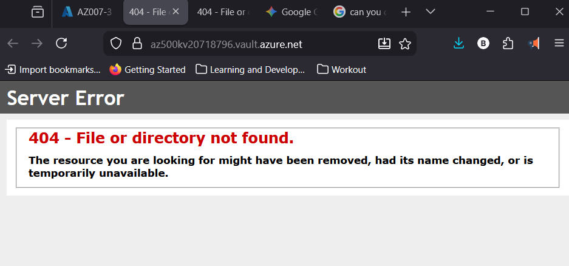

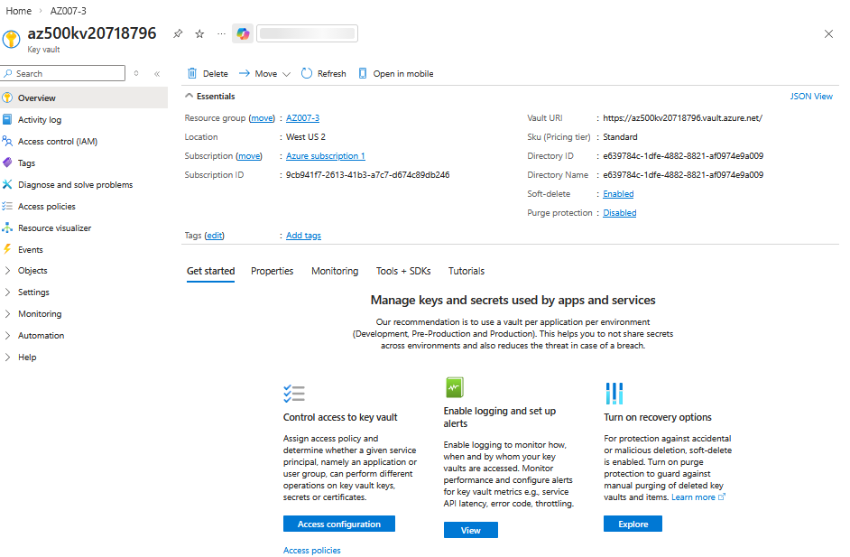

---

### Configure Key Vault Access Policy

1. Navigate to **Resource Groups → AZ500Lab10**.
2. Open the **Key Vault**.
3. Select **Access Policies → + Create**.

Configure:

| Setting                 | Value                                |
| ----------------------- | ------------------------------------ |
| Template                | Key, Secret & Certificate Management |
| Key Permissions         | Select All                           |
| Secret Permissions      | Select All                           |
| Certificate Permissions | Select All                           |
| Principal               | Your user account                    |

4. Click **Create**.


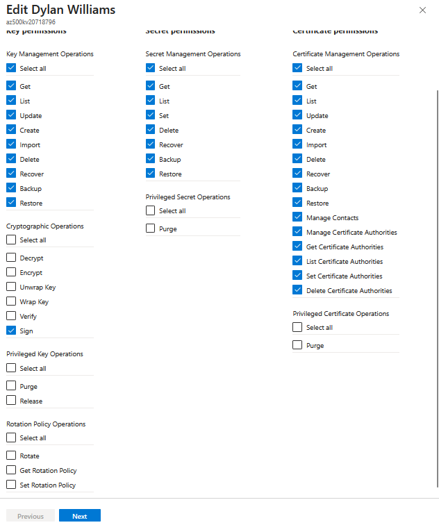


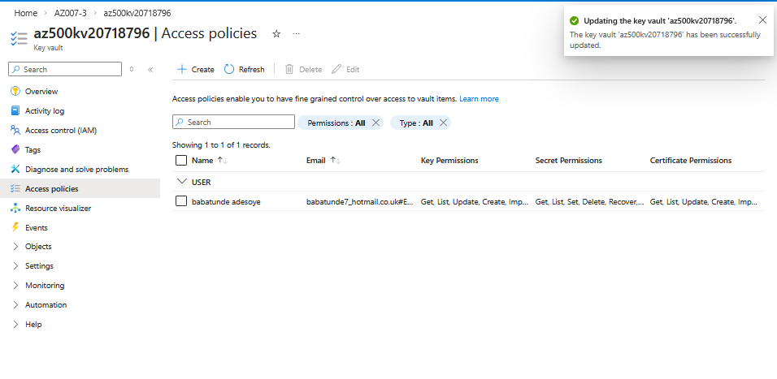


---

## Task 2: Add a Key to Key Vault

Open **Cloud Shell** and run:

```powershell
$kv = Get-AzKeyVault -ResourceGroupName 'AZ500Lab10'

$key = Add-AzKeyVaultKey `
 -VaultName $kv.VaultName `
 -Name 'MyLabKey' `
 -Destination 'Software'
```

Verify:

```powershell
Get-AzKeyVaultKey -VaultName $kv.VaultName
```

Display key identifier:

```powershell
$key.key.kid
```

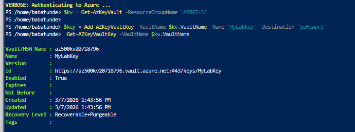

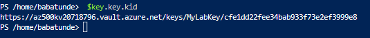


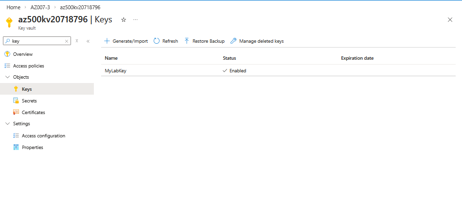

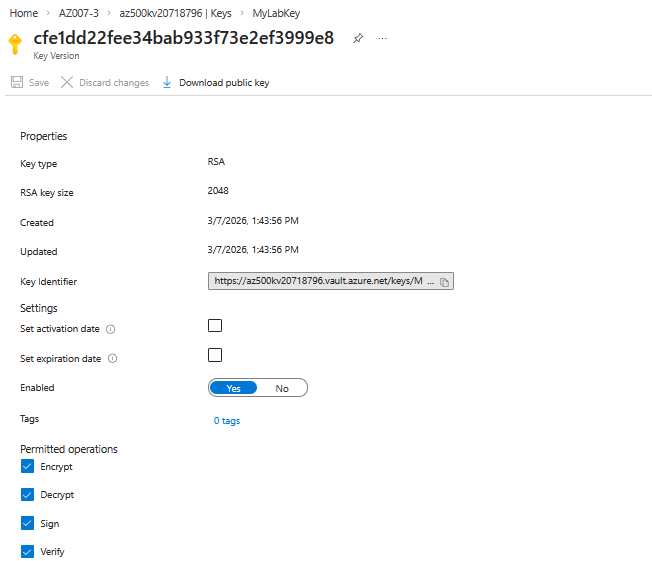

* **Vault URI Example**:

    * https://az500kv20718796.vault.azure.net/keys/MyLabKey
    * https://az500kv20718796.vault.azure.net/keys/MyLabKey/cfe1dd22fee34bab933f73e2ef3999e8


---

## Task 3: Add a Secret to Key Vault

Create a secure string:

```powershell
$secretvalue = ConvertTo-SecureString 'Pa55w.rd1234' -AsPlainText -Force
```

Add secret:

```powershell
$secret = Set-AzKeyVaultSecret `
 -VaultName $kv.VaultName `
 -Name 'SQLPassword' `
 -SecretValue $secretvalue
```

Verify:

```powershell
Get-AzKeyVaultSecret -VaultName $kv.VaultName
```


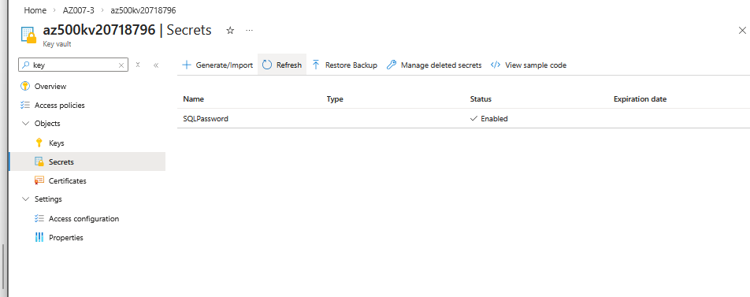

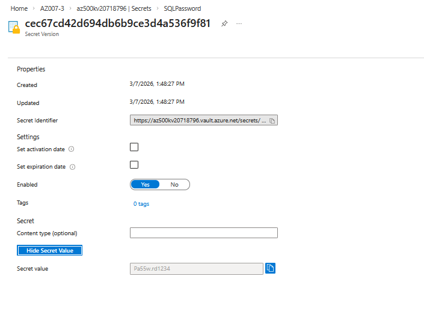


* **Sercet URL**:

    * https://az500kv20718796.vault.azure.net/secrets/SQLPassword/cec67cd42d694db6b9ce3d4a536f9f81
    
---

# Exercise 3: Configure an Azure SQL database and a data-driven application

---

## Task 1: Enable a client application to access Azure SQL Database

1. Search **App registrations** in Azure Portal.
2. Click **+ New registration**.

Configure:

| Setting      | Value                                  |
| ------------ | -------------------------------------- |
| Name         | sqlApp                                 |
| Redirect URI | Web → [https://sqlapp](https://sqlapp) |

Click **Register**.

Record the:

* **Application (client) ID**


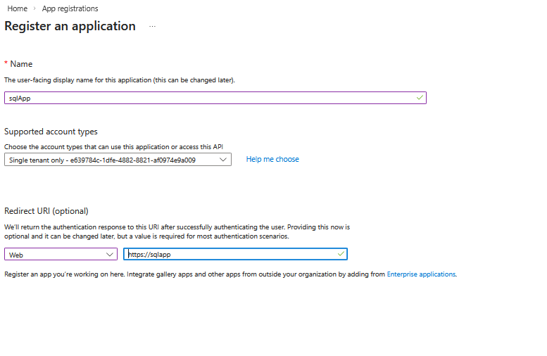


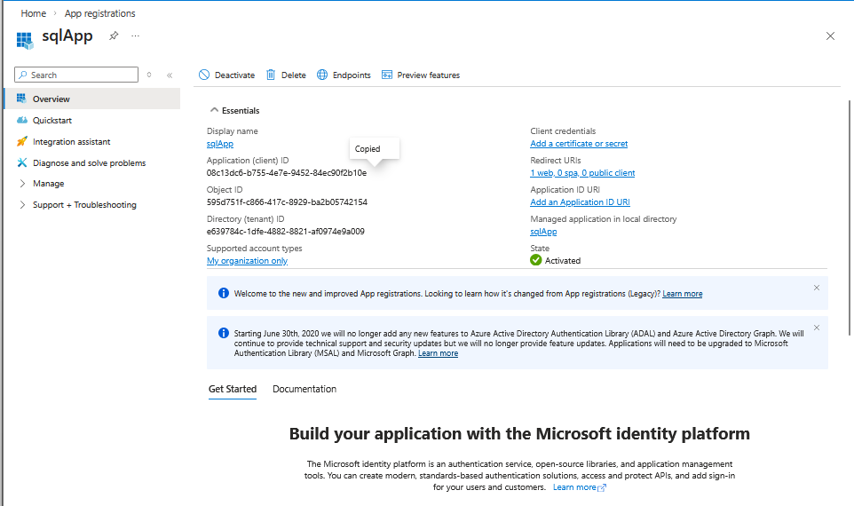

---

### Create Client Secret

1. Navigate to **Certificates & Secrets**.
2. Click **+ New client secret**.

| Setting     | Value     |
| ----------- | --------- |
| Description | Key1      |
| Expiration  | 12 months |

Copy the **secret value immediately**.


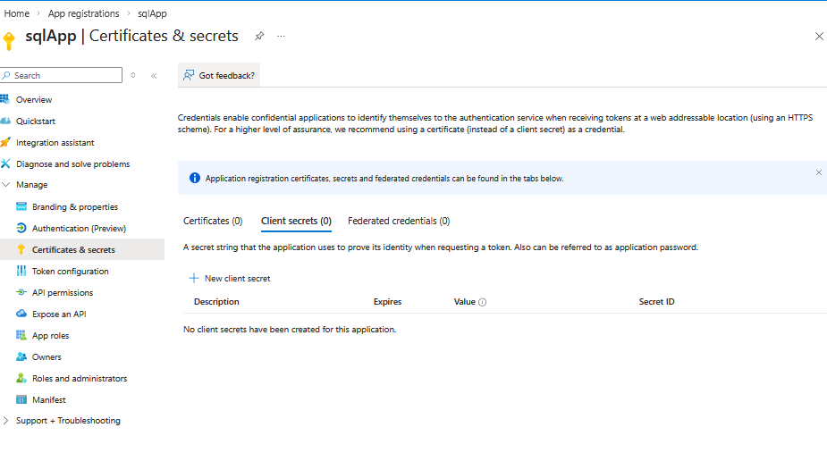
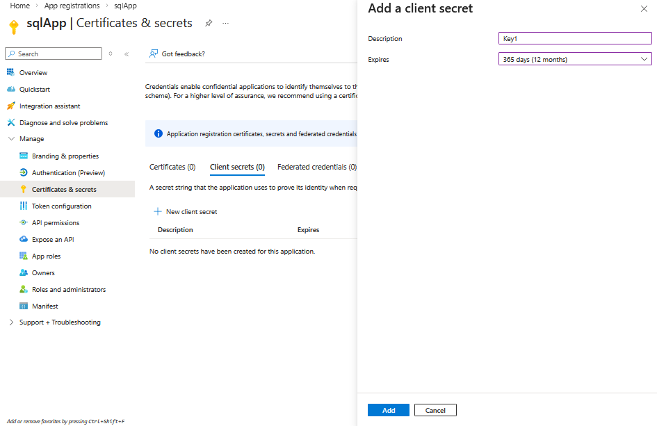
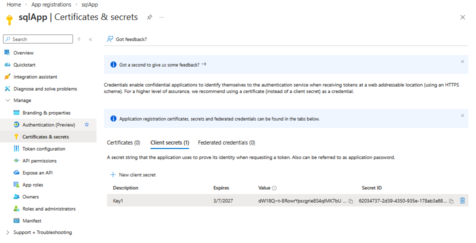

---

## Task 2: Grant Key Vault access to the application

Open **Cloud Shell**:

```powershell
$applicationId = '<Application-ID>'
```

Retrieve vault name:

```powershell
$kvName = (Get-AzKeyVault -ResourceGroupName 'AZ500Lab10').VaultName
```

Grant permissions:

```powershell
Set-AzKeyVaultAccessPolicy `
 -VaultName $kvName `
 -ResourceGroupName AZ500Lab10 `
 -ServicePrincipalName $applicationId `
 -PermissionsToKeys get,wrapKey,unwrapKey,sign,verify,list
```
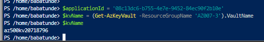


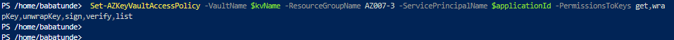

---

## Task 3: Retrieve SQL Database Connection String

1. Search **SQL databases**.
2. Select **medical** database.
3. Open **Connection Strings**.

Copy the **ADO.NET connection string**.

Replace:

```
{your_password}
```

with your SQL password.


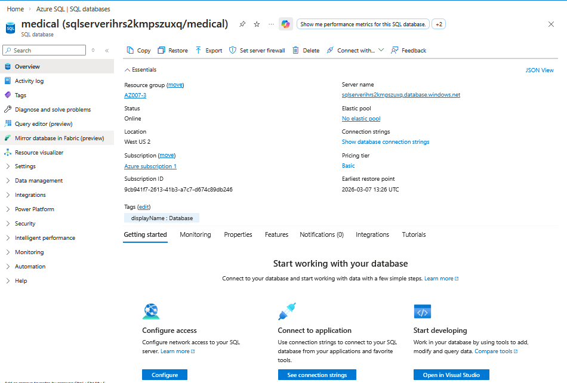

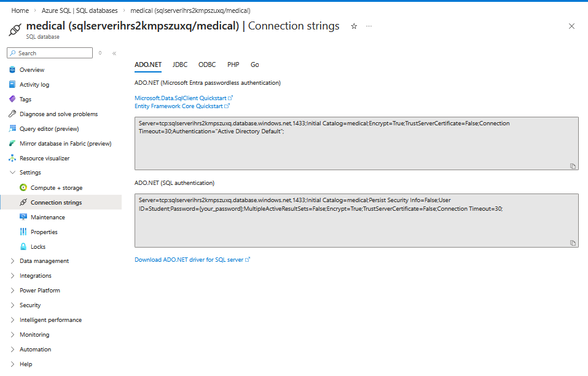


---

## Task 4: Connect to the Azure Virtual Machine

1. Search **Virtual Machines**.
2. Open **az500-10-vm1**.
3. Copy the **Public IP address**.

Click:

```
Connect → RDP
```

Login using:

| Setting  | Value        |
| -------- | ------------ |
| Username | Student      |
| Password | Lab password |


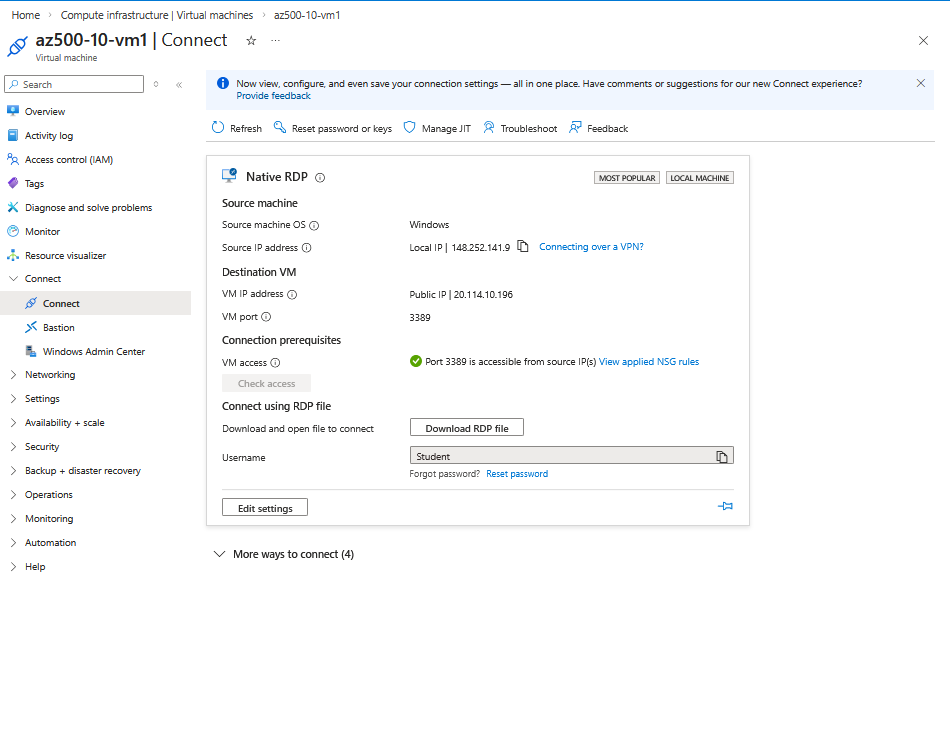


---

## Task 5: Create SQL Table and Encrypt Columns


In this task, you will connect to the SQL Database with SQL Server Management Studio and create a table. You will then encrypt two data columns using an autogenerated key from the Azure Key Vault.

In the Azure portal, navigate to the blade of the medical SQL database, in the Essentials section, identify the Server name (copy to clipboard), and then, in the toolbar, click Set server firewall.

Note: Record the server name. You will need the server name later in this task.

On the Firewall settings blade, scroll down to Rule Name, click + Add a firewall rule, and specify the following settings:

* **Setting**: Value
* **Rule Name**: Allow Mgmt VM
* **Start IP**: the Public IP Address of the az500-10-vm1
* **End IP**: the Public IP Address of the az500-10-vm1

Click **Save** to save the change and close the confirmation pane.


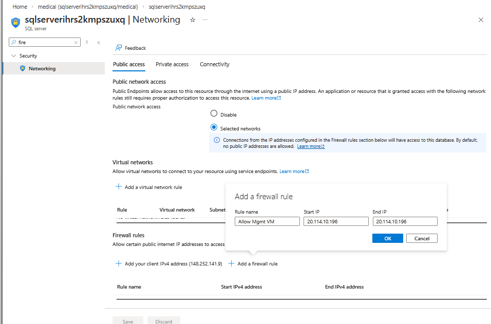


Open **SQL Server Management Studio**.

Connect using:

| Setting        | Value                     |
| -------------- | ------------------------- |
| Server Type    | Database Engine           |
| Server Name    | Azure SQL Server name     |
| Authentication | SQL Server Authentication |

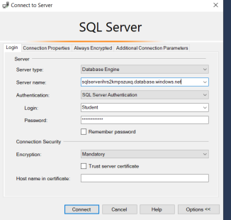


Run the following SQL query:

```sql
CREATE TABLE [dbo].[Patients](
 [PatientId] INT IDENTITY(1,1),
 [SSN] CHAR(11) NOT NULL,
 [FirstName] NVARCHAR(50),
 [LastName] NVARCHAR(50),
 [MiddleName] NVARCHAR(50),
 [StreetAddress] NVARCHAR(50),
 [City] NVARCHAR(50),
 [ZipCode] CHAR(5),
 [State] CHAR(2),
 [BirthDate] DATE NOT NULL
 PRIMARY KEY CLUSTERED ([PatientId] ASC)
);
```

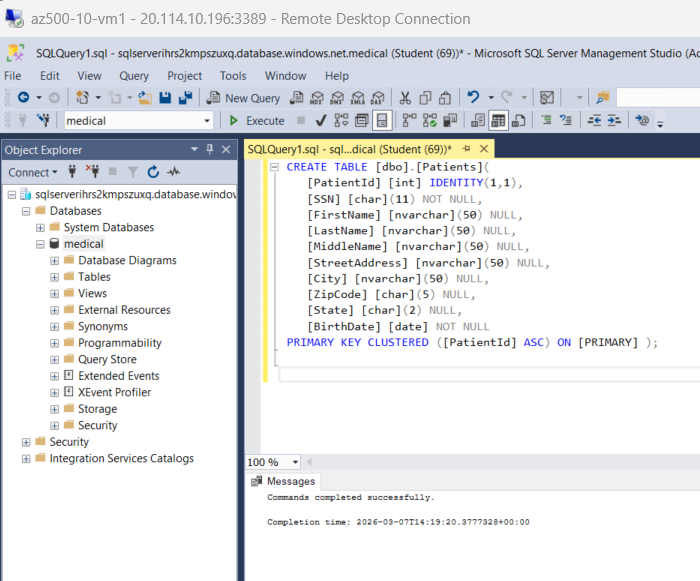


---

### Encrypt Sensitive Columns

Worth Noting:

- Change to Dylan@babatunde7hotmailco.onmicrosoft.com as the tenant account was blocked.

- To assign a user to an Azure subscription, navigate to the Subscriptions menu in the Azure Portal, 
* select your subscriptionnclick Access Control (IAM)
* Add a role assignment (e.g., Owner or Contributor) to the user. 

The user must already exist in your Microsoft Entra ID (Azure AD).

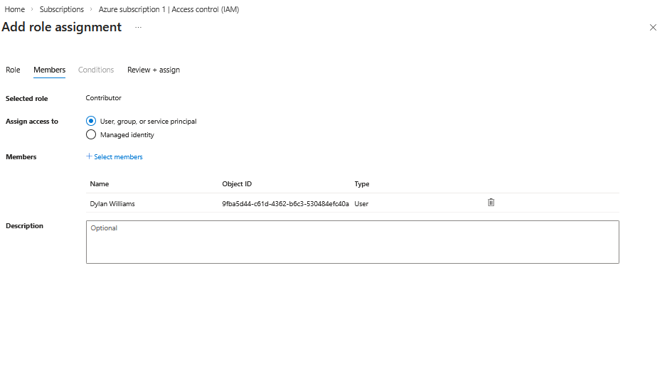

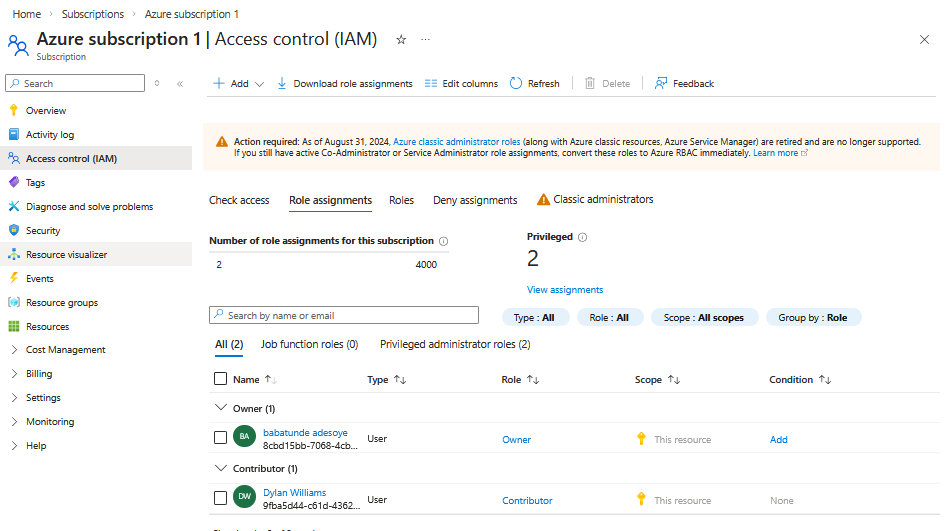


1. Right-click **dbo.Patients**.
2. Select **Encrypt Columns**.

Wizard configuration:

| Column    | Encryption Type |
| --------- | --------------- |
| SSN       | Deterministic   |
| BirthDate | Randomized      |

Select:

```
Azure Key Vault
```

Sign in when prompted and select your **Key Vault**.

Finish the wizard.

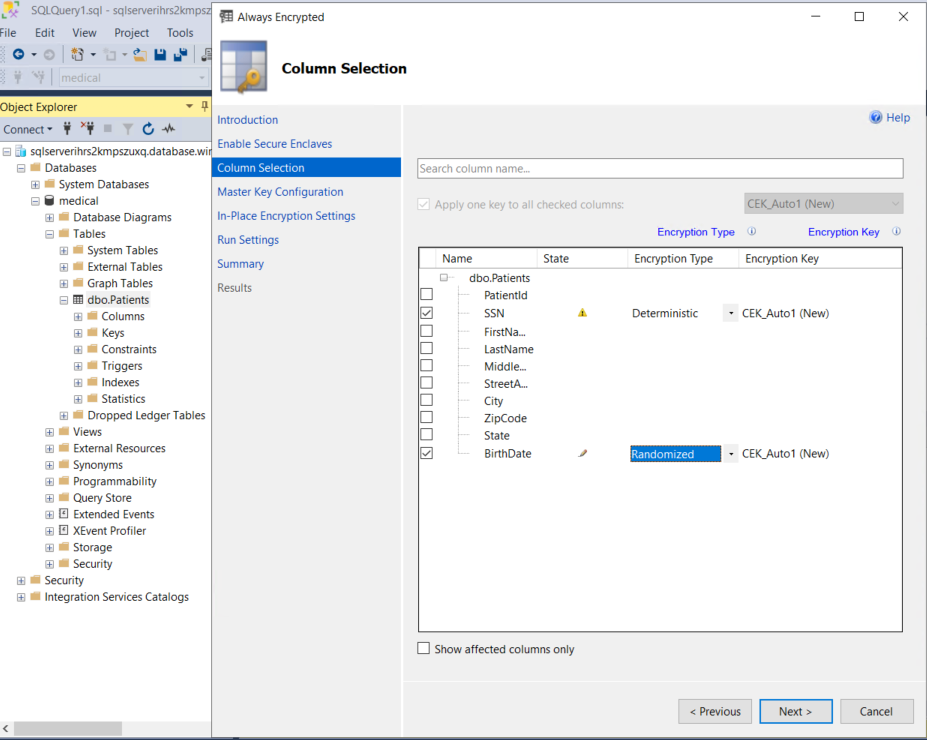
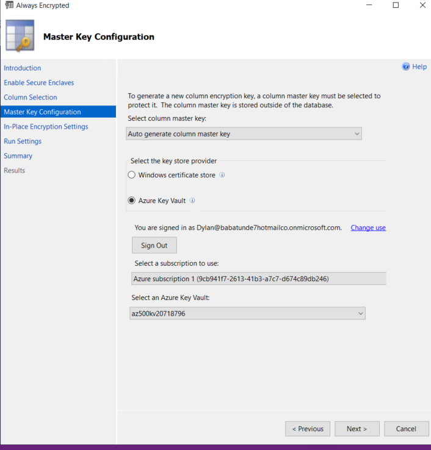
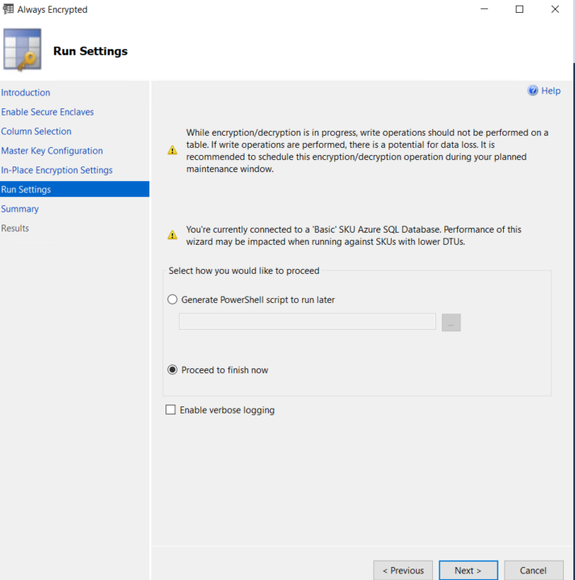
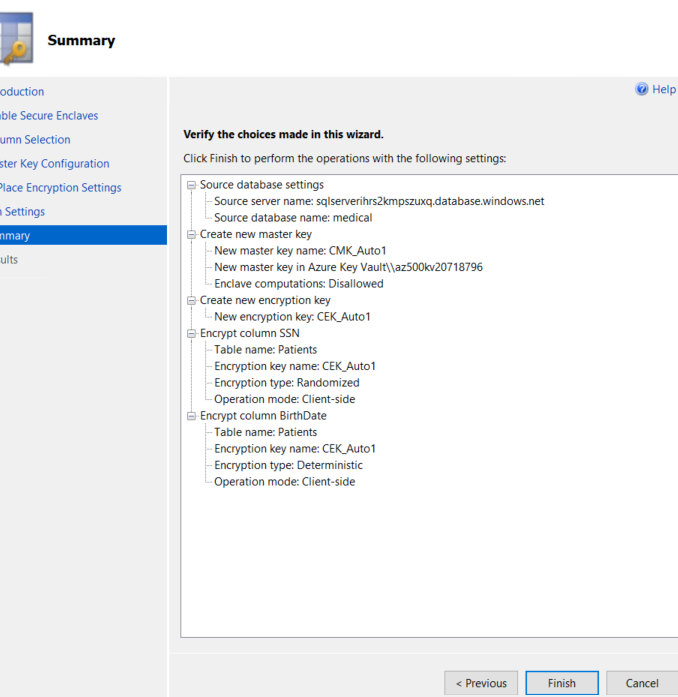
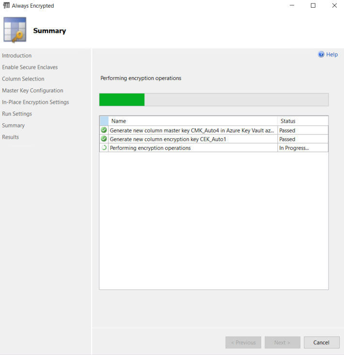
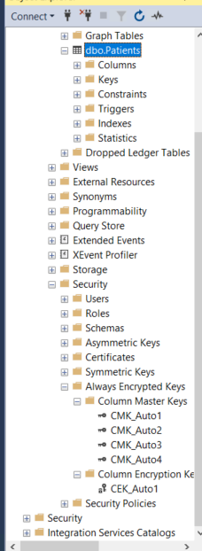
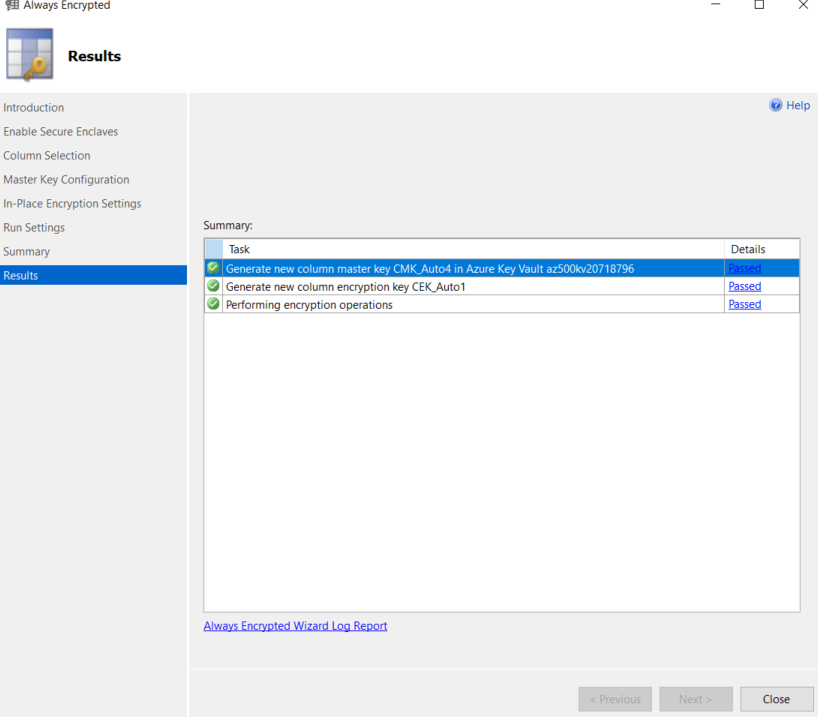


---

# Exercise 4: Demonstrate the use of Azure Key Vault in encrypting the Azure SQL database

---

## Task 1: Install Visual Studio

Inside the VM:

1. Open browser.
2. Navigate to:

```
https://visualstudio.microsoft.com/downloads
```

3. Download **Visual Studio Community**.
4. Install workload:

```
.NET Desktop Development
```

---

## Task 2: Run a secure data-driven application

Create a new project:

| Setting      | Value                        |
| ------------ | ---------------------------- |
| Project Type | Console App (.NET Framework) |
| Project Name | OpsEncrypt                   |
| Framework    | .NET Framework 4.7.2         |

Install required packages:

```powershell
Install-Package Microsoft.SqlServer.Management.AlwaysEncrypted.AzureKeyVaultProvider
```
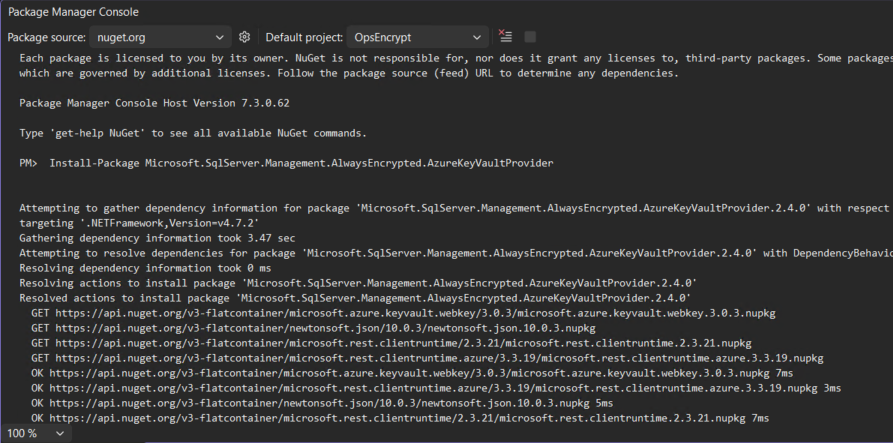
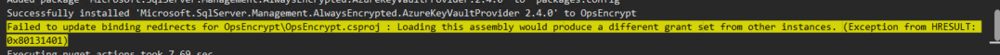


```powershell
Install-Package Microsoft.IdentityModel.Clients.ActiveDirectory
```

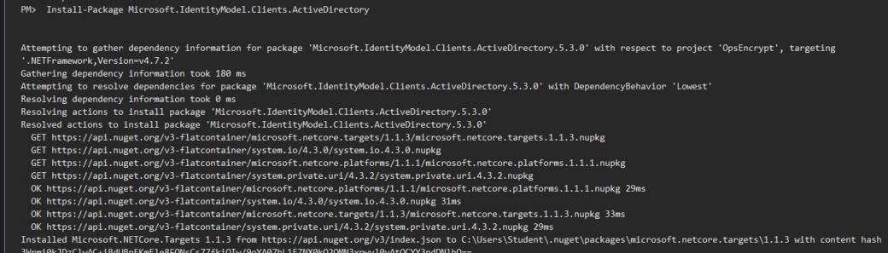
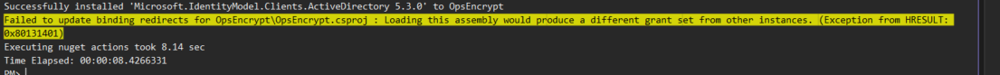

Replace **Program.cs** with the provided lab file.

Update:

| Code Line         | Replace With                |
| ----------------- | --------------------------- |
| Connection String | Azure SQL connection string |
| Client ID         | App Registration ID         |
| Secret            | Client Secret               |

Run the application.


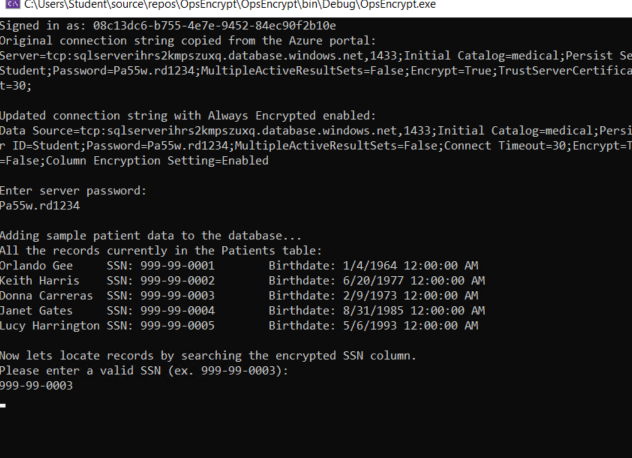

---

### Verify Encryption

In **SQL Server Management Studio**, run:

```sql
SELECT FirstName, LastName, SSN, BirthDate FROM Patients;
```

Expected:

* Data appears **encrypted in SQL**
* Application **decrypts it automatically**

Test query in the console application:

```
999-99-0003
```

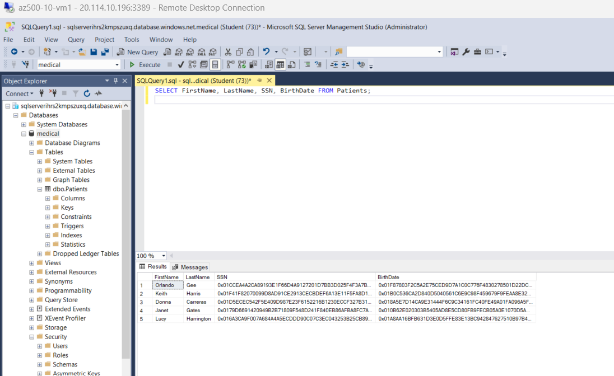

---

# Clean up resources

To avoid unnecessary Azure costs, remove the resource group.

Open **Cloud Shell** and run:

```powershell
Remove-AzResourceGroup `
 -Name "AZ003-3" `
 -Force `
 -AsJob
```

This deletes all resources created in the lab.

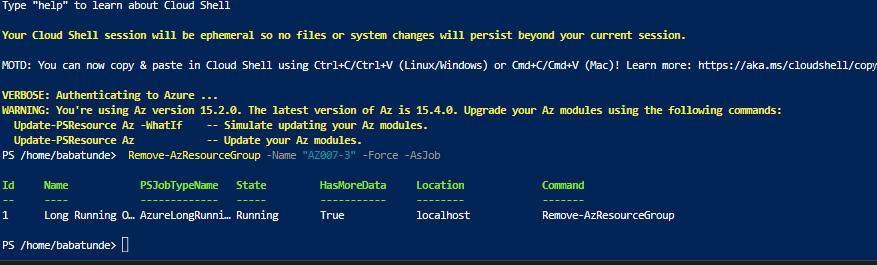

---

✅ **Lab Complete**

You successfully implemented:

* Azure Key Vault
* SQL Always Encrypted
* Secure application access using Microsoft Entra ID


---

# Lessons Learned

* 🔐 **Azure Key Vault** securely stores cryptographic keys and secrets, helping protect sensitive credentials and encryption keys.
* 🗄️ **Always Encrypted** protects sensitive SQL data (e.g., SSN, BirthDate) by encrypting columns so that even database administrators cannot read the data.
* 🔑 **Microsoft Entra ID authentication** enables secure application access to Azure resources without exposing credentials in code.
* 🛡️ **Key Vault access policies** control which users or applications can retrieve encryption keys.
* 🧪 **Testing with a client application** confirmed that encrypted data appears unreadable in SQL Server but is automatically decrypted for authorized applications.

## 🎯 Key takeaway:
Combining **Azure Key Vault 🔐, Always Encrypted 🗄️, and Entra ID authentication 🔑** provides a strong **defense-in-depth approach for protecting sensitive cloud database data**.


