# 🌐🔍 Lab 08: Create a Log Analytics Workspace, Azure Storage Account, and Data Collection Rule (DCR)

### CCSP Domain:

#### ☁️ D3. Cloud Platform & Infrastructure Security

#### 🔑 D5. Cloud Security Operations

-----

# 📚 Lab Navigation

### 🔎 Overview

  * [Lab Scenario](#lab-scenario)
  * [Lab Objectives](#lab-objectives)
  * [Architecture Diagram](#architecture-diagram)
  * [Exercise 1: Deploy an Azure Virtual Machine](#exercise-1-deploy-an-azure-virtual-machine)
  * [Exercise 2: Create a Log Analytics Workspace](#exercise-2-create-a-log-analytics-workspace)
  * [Exercise 3: Create an Azure Storage Account](#exercise-3-create-an-azure-storage-account)
  * [Exercise 4: Create a Data Collection Rule](#exercise-4-create-a-data-collection-rule)
  * [Lessons Learned](#lessons-learned)

-----

# Lab Scenario

As an **Azure Security Engineer** for a financial technology company, you are tasked with enhancing monitoring and security visibility across all Azure virtual machines (VMs). These VMs process financial transactions and manage sensitive customer data.

The **Chief Information Security Officer (CISO)** requires a solution to:

  * Collect security events and system logs.
  * Monitor performance counters to optimize system health.
  * Centralize log collection using the **Azure Monitor Agent (AMA)** and **Data Collection Rules (DCRs)**.

-----

# Lab Objectives

In this lab, you will complete the following exercises:

| Exercise | Description |
| :--- | :--- |
| **Exercise 1** | Deploy an Azure virtual machine via Cloud Shell |
| **Exercise 2** | Create a Log Analytics workspace for centralized logging |
| **Exercise 3** | Create an Azure storage account for data persistence |
| **Exercise 4** | Configure a Data Collection Rule (DCR) to define data flow |

**Estimated Lab Time:** 45 minutes

-----

# Architecture Diagram

This lab demonstrates the modern Azure monitoring pipeline:

1.  **Azure Monitor Agent (AMA):** Installed on the VM to gather data.
2.  **Data Collection Rule (DCR):** Acts as the "traffic controller," defining what data to collect and where to send it.
3.  **Log Analytics Workspace:** The central repository for indexing and querying the logs.

-----

# Exercise 1: Deploy an Azure virtual machine

**Goal:** Create the underlying infrastructure and resource group using PowerShell.

-----

## Task 1: Deploy an Azure virtual machine

1.  Sign in to the **Azure Portal**: [https://portal.azure.com/](https://portal.azure.com/)
2.  Open the **Cloud Shell** (first icon in the top right) and select **PowerShell**.
3.  Create the Resource Group:


```powershell
New-AzResourceGroup -Name AZ500LAB131415 -Location 'EastUS'
```


4.  Enable **Encryption at Host (EAH)**:


```powershell
Register-AzProviderFeature -FeatureName "EncryptionAtHost" -ProviderNamespace Microsoft.Compute
```

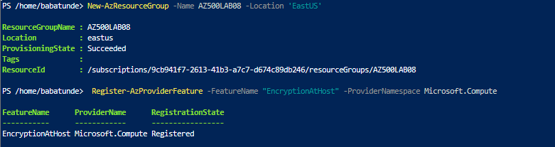

5.  Deploy the Virtual Machine:


```powershell
New-AzVm -ResourceGroupName "AZ500LAB131415" -Name "myVM" -Location 'EastUS' -VirtualNetworkName "myVnet" -SubnetName "mySubnet" -SecurityGroupName "myNetworkSecurityGroup" -PublicIpAddressName "myPublicIpAddress" -PublicIpSku Standard -OpenPorts 80,3389 -Size Standard_D2_v4
```
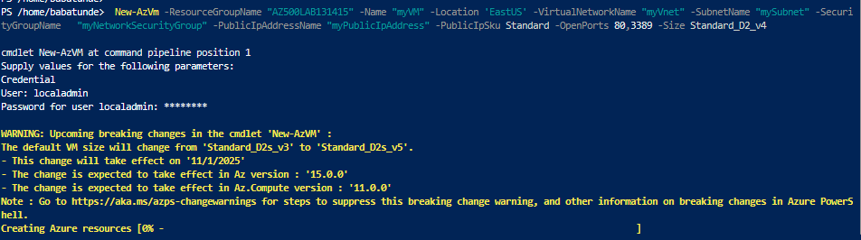

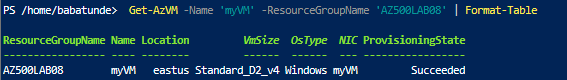

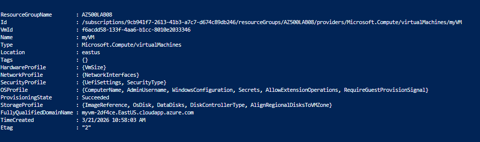


6.  **Confirm Deployment:**


```powershell
Get-AzVM -Name 'myVM' -ResourceGroupName 'AZ500LAB131415' | Format-Table
```


-----

# Exercise 2: Create a Log Analytics workspace

**Goal:** Setup the destination for your security and performance data.

1.  Search for **Log Analytics workspaces** in the portal.
2.  Click **+ Create** and use the following:

| Setting | Value |
| :--- | :--- |
| **Resource Group** | AZ500LAB131415 |
| **Name** | lgawIgnite |
| **Region** | East US |

3.  Select **Review + Create**, then click **Create**.

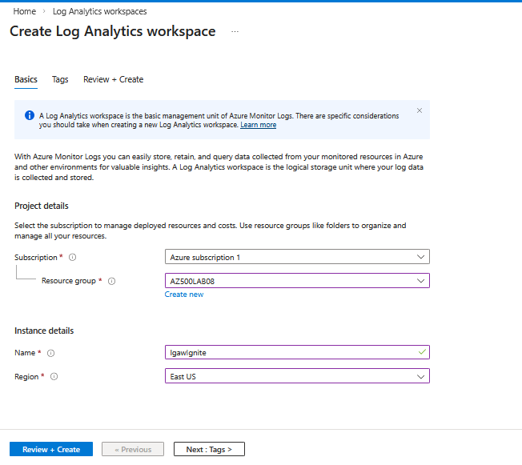

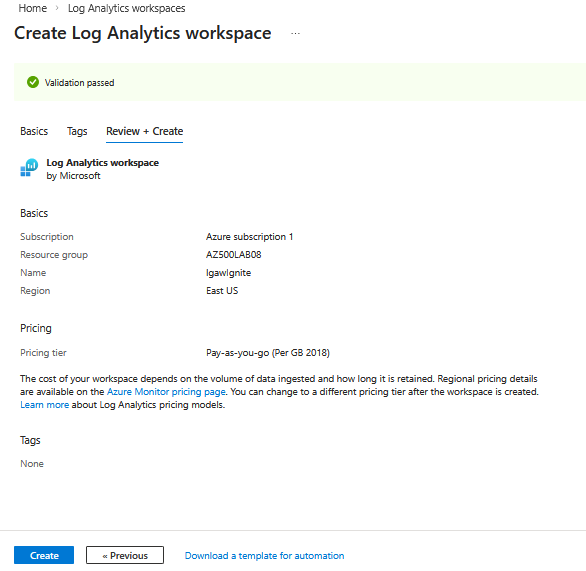

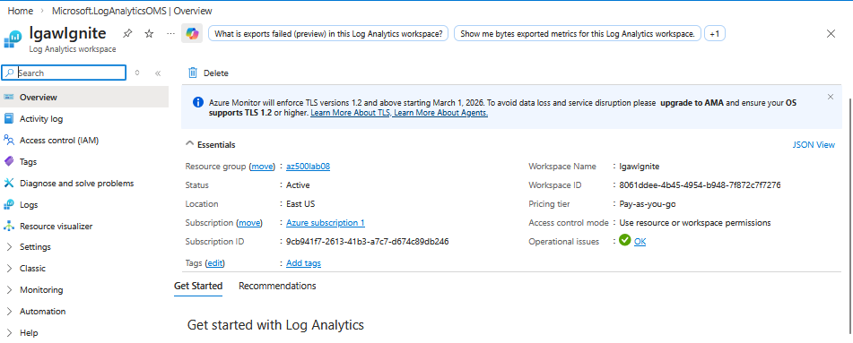


-----

# Exercise 3: Create an Azure storage account

**Goal:** Provide a storage layer for diagnostic data or long-term retention.

1.  Search for **Storage accounts** and click **+ Create**.
2.  Configure the **Basics** tab:

| Setting | Value |
| :--- | :--- |
| **Resource Group** | AZ500LAB131415 |
| **Storage Account Name** | strgactignite[Unique ID] |
| **Region** | East US |
| **Performance** | Standard |
| **Redundancy** | Locally redundant storage (LRS) |

3.  Click **Review + Create**, then **Create**.


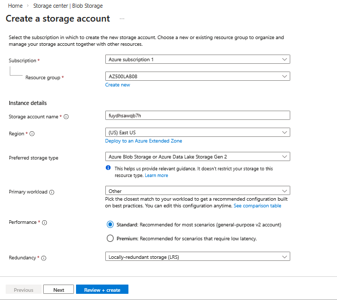
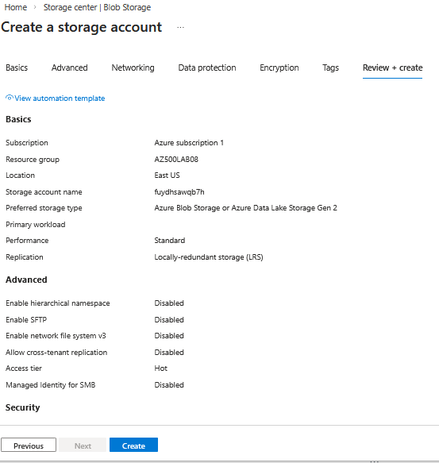


-----

# Exercise 4: Create a Data Collection Rule

**Goal:** Define exactly which performance counters to collect and send them to the workspace.

1.  Search for **Monitor** in the portal.
2.  Select **Data Collection Rules** \> **+ Create**.
3.  **Basics Tab:**
      * **Rule Name:** DCR1
      * **Platform Type:** Windows
4.  **Resources Tab:**
      * Select **+ Add resources** and check your Subscription/Resource Group to include `myVM`.
5.  **Collect and Deliver Tab:**
      * Click **+ Add data source**.
      * **Type:** Performance Counters (CPU, Memory, Disk, Network).
      * **Destination:** Add **Azure Monitor Logs** and select your `lgawIgnite` workspace.
6.  Click **Review + create** \> **Create**.


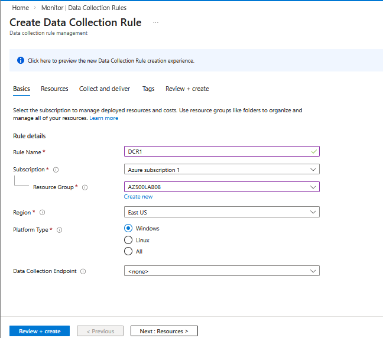

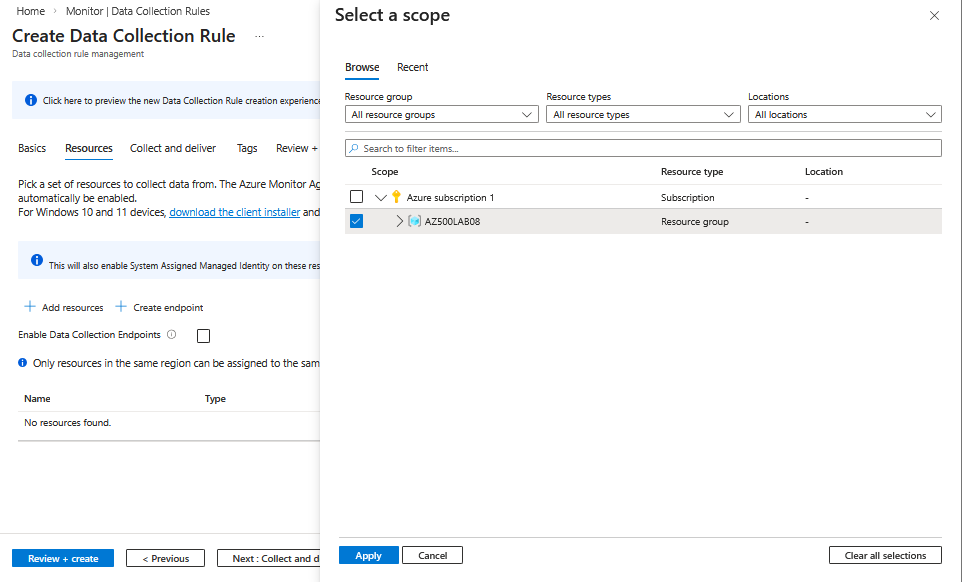

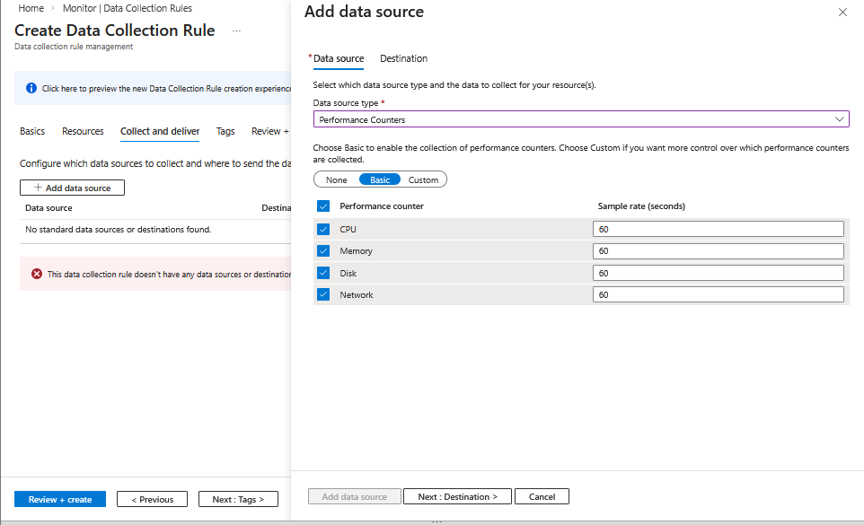

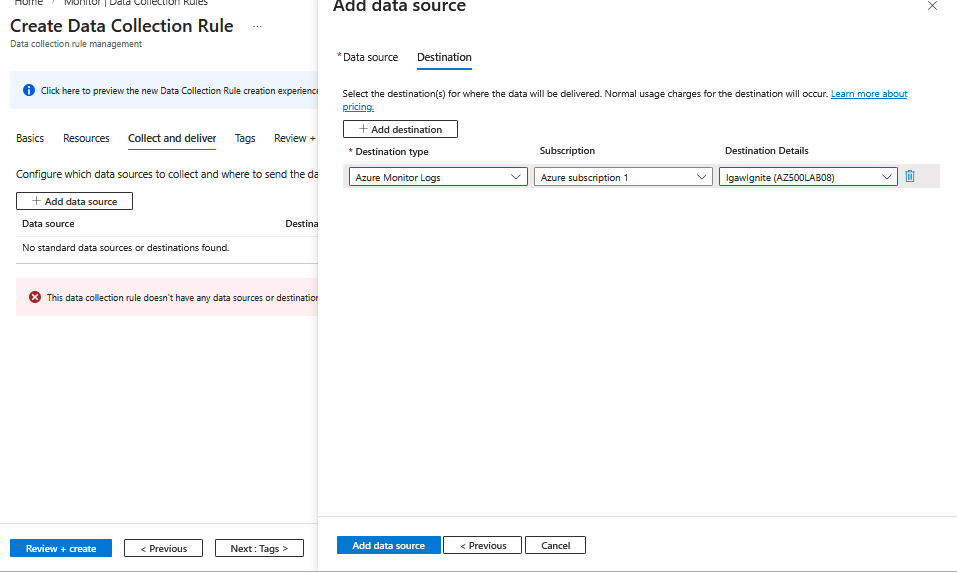

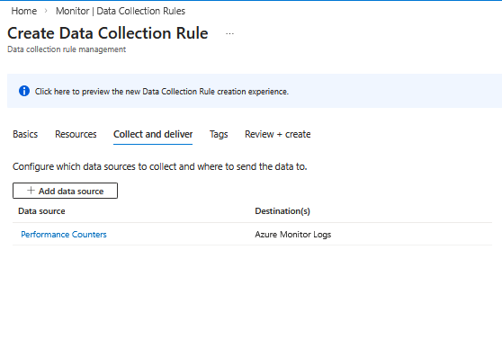


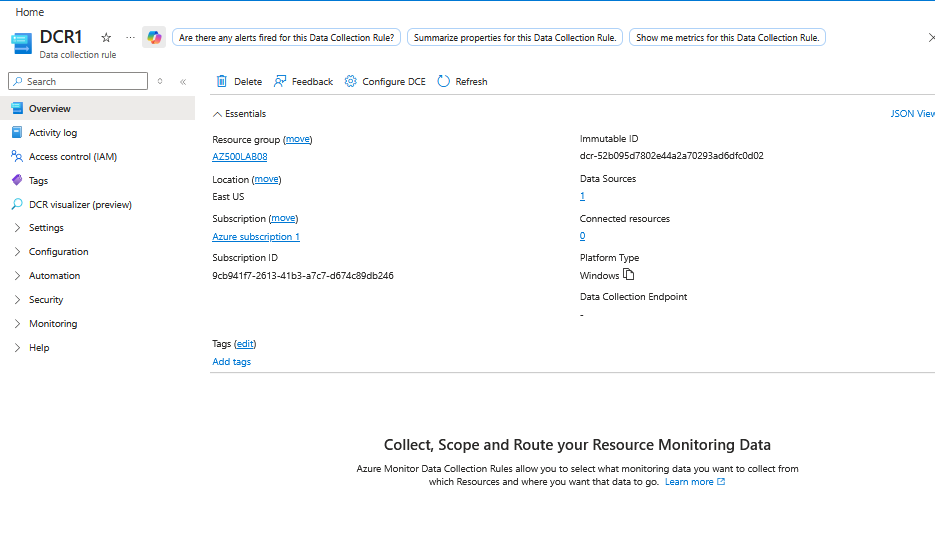


-----

### Results

You have successfully built a centralized logging pipeline using the **Azure Monitor Agent**.

> [\!IMPORTANT]
> **Do not delete these resources.** They are required for upcoming labs involving Microsoft Defender for Cloud and Microsoft Sentinel.

# 📝 Lessons Learned: Azure Monitoring & Log Centralization

* **🚦 DCR as a Traffic Controller:** **Data Collection Rules (DCRs)** provide granular control, allowing you to define exactly "what" data to collect (e.g., specific CPU counters) and "where" to send it (e.g., Log Analytics) at scale.
* **🗄️ Centralized Indexing:** A **Log Analytics Workspace** serves as the primary engine for security analysis, enabling complex KQL (Kusto Query Language) searches across all connected infrastructure.
* **🔐 Security at the Host:** Enabling **Encryption at Host (EAH)** ensures that data handled by the VM temporary disk and cache is encrypted at rest, fulfilling high-compliance financial industry requirements.

---

## 🎯 Key takeaway:
Building a monitoring pipeline with **Log Analytics 🔍**, **Storage Accounts 📦**, and **Data Collection Rules 🚦** creates a **unified observability framework** that is essential for both system health and advanced threat detection.
