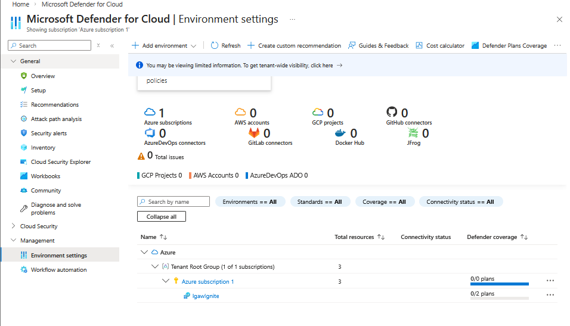
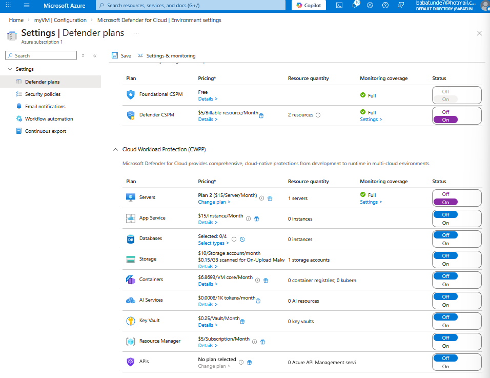
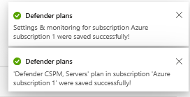

# 🌐🛡️ Lab 09: Configuring Microsoft Defender for Cloud Enhanced Security Features for Servers

### CCSP Domain:

#### ☁️ D3. Cloud Platform & Infrastructure Security

#### 🔑 D5. Cloud Security Operations

-----

# 📚 Lab Navigation

### 🔎 Overview

  * [Lab Scenario](#lab-scenario)
  * [Lab Objectives](#lab-objectives)
  * [Architecture Diagram](#architecture-diagram)
  * [Exercise: Configure Microsoft Defender for Servers](#exercise-configure-microsoft-defender-for-cloud-enhanced-security-features-for-servers)
  * [Feature Review: Defender for Servers Plan 2](#review-defender-for-servers-plan-2-features)
  * [Lessons Learned](#lessons-learned)

-----

# Lab Scenario

As an **Azure Security Engineer** for a global e-commerce company, you are responsible for protecting a high-traffic environment consisting of both Azure VMs and on-premises hybrid servers.

Following a risk assessment by the **CISO**, the organization has prioritized advanced threat protection to mitigate cyber threats, vulnerabilities, and potential misconfigurations. You have been tasked with enabling **Microsoft Defender for Servers** to centralize security monitoring and provide proactive defense across your entire server estate.

-----

# Lab Objectives

In this lab, you will complete the following tasks:

| Objective | Description |
| :--- | :--- |
| **Enable Defender for Servers** | Activate Cloud Workload Protection (CWPP) at the subscription level. |
| **Plan Review** | Verify and review the advanced features included in **Defender for Servers Plan 2**. |

**Estimated Lab Time:** 15 minutes

-----

# Architecture Diagram

This setup demonstrates how **Microsoft Defender for Cloud** acts as a unified security management system that protects:

1.  **Azure Native Resources:** Virtual Machines and Scale Sets.
2.  **Hybrid Cloud:** On-premises servers connected via Azure Arc.
3.  **Multi-cloud:** Servers running in AWS or GCP.

-----

# Exercise: Configure Microsoft Defender for Cloud Enhanced Security Features for Servers

**Goal:** Transition from basic security recommendations to advanced workload protection.

### Steps

1.  **Access Defender for Cloud:**

      * In the Azure portal search bar, type **Microsoft Defender for Cloud** and press Enter.

2.  **Navigate to Environment Settings:**

      * On the left-hand sidebar under **Management**, click **Environment settings**.
      * Expand the folder structure and click on your specific **Subscription** name.

    

3.  **Enable Server Protection:**

      * Under the **Settings** blade, ensure you are on the **Defender plans** tab.
      * Locate the **Cloud Workload Protection (CWPP)** section.
      * Find **Servers** in the list. Change the status from **Off** to **On**.
      * Click **Save** at the top of the page.

    

4.  **Verify Plan Level:**

      * To confirm you are using the most comprehensive protection, click **Change plan** next to the Servers row.
      * Note that enabling the plan by default activates **Microsoft Defender for Servers Plan 2**.

    
    

-----

# Review: Defender for Servers Plan 2 Features

By enabling Plan 2, you have unlocked several high-value security capabilities:

  * **Vulnerability Assessment:** Powered by Qualys or Microsoft Defender Vulnerability Management to identify unpatched software.
  * **Just-In-Time (JIT) VM Access:** Reduces exposure to brute-force attacks by opening RDP/SSH ports only when requested and approved.
  * **File Integrity Monitoring (FIM):** Tracks changes to critical files and registry settings to detect potential tampering.
  * **Adaptive Application Controls:** Uses AI to create allow-lists of known safe applications, blocking unauthorized software execution.
  * **Microsoft Defender for Endpoint Integration:** Seamless deployment of advanced EDR (Endpoint Detection and Response) capabilities.

-----

### Results

You have successfully elevated the security posture of your subscription by enabling **Microsoft Defender for Servers Plan 2**. This provides the "Enhanced Security" features necessary for regulatory compliance and advanced threat detection.

# 📝 Lessons Learned: Microsoft Defender for Servers

* **🛡️ CWPP Foundation:** Enabling **Microsoft Defender for Servers** transitions your environment from static security posture management (CSPM) to active **Cloud Workload Protection (CWPP)**.

---

## 🎯 Key takeaway:
Activating **Microsoft Defender for Servers Plan 2 🛡️** provides a robust **defense-in-depth strategy** that centralizes threat detection, vulnerability management, and access control across any server estate, regardless of where it resides.
