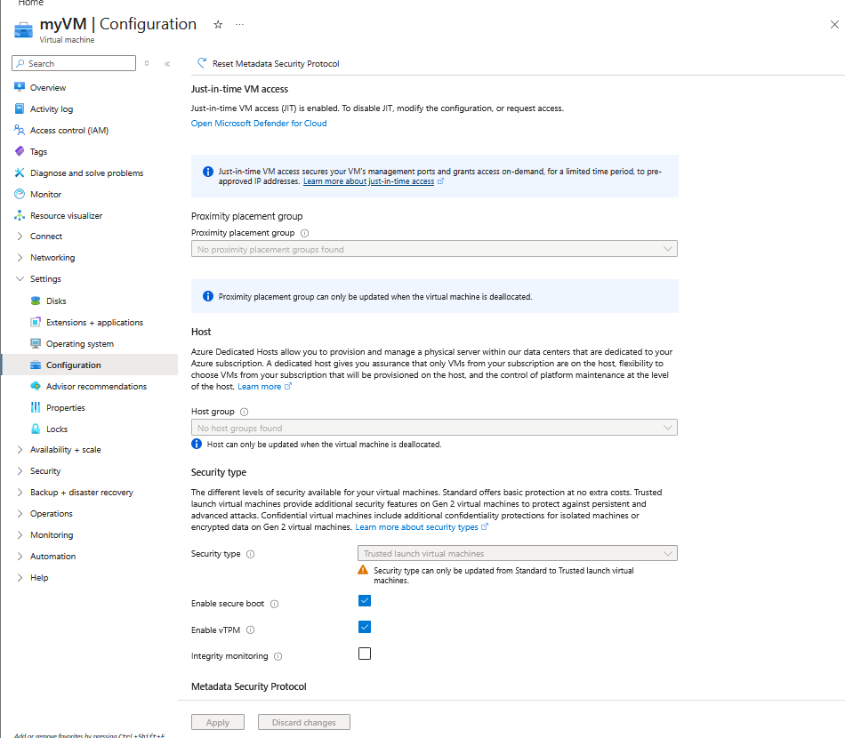
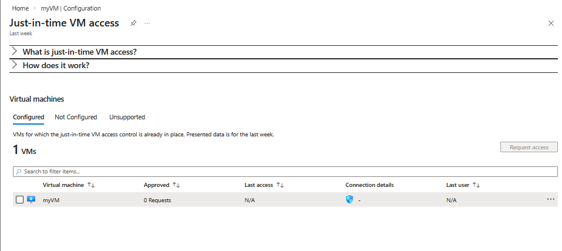
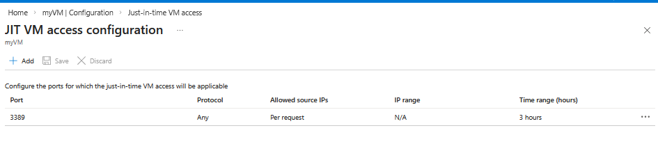
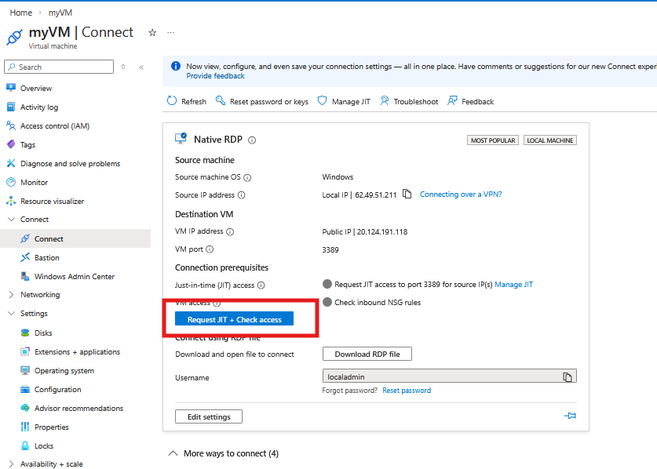
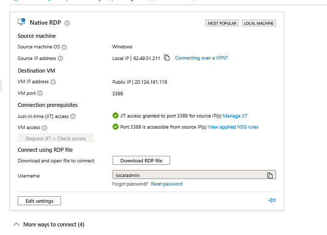
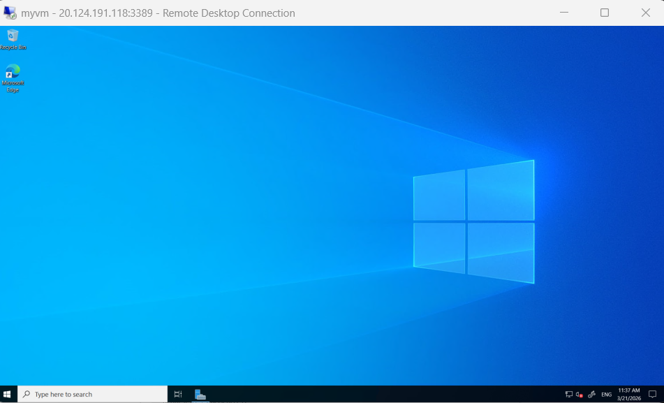

# 🌐🛡️ Lab 10: Enable Just-in-Time (JIT) Access on VMs

### CCSP Domain:

#### ☁️ D3. Cloud Platform & Infrastructure Security

#### 🔑 D5. Cloud Security Operations

-----

# 📚 Lab Navigation

### 🔎 Overview

  * [Lab Scenario](#lab-scenario)
  * [Lab Objectives](#lab-objectives)
  * [Architecture Diagram](#architecture-diagram)
  * [Exercise 1: Enable JIT on your VMs](#exercise-1-enable-jit-on-your-vms-from-azure-virtual-machines)
  * [Exercise 2: Request Access to a JIT-enabled VM](#exercise-2-request-access-to-a-jit-enabled-vm)
  * [Lessons Learned](#lessons-learned)

-----

# Lab Scenario

As an **Azure Security Engineer** at a financial services company, you are responsible for securing critical virtual machines (VMs) that process financial transactions.

The security team has identified that leaving management ports (like RDP 3389) open 24/7 significantly increases the risk of **brute-force attacks**. To mitigate this, the **CISO** has requested the implementation of **Just-in-Time (JIT) VM access**. This ensures that ports are only opened upon a validated request, for a limited time, and only for specific authorized IP addresses.

-----

# Lab Objectives

In this lab, you will complete the following exercises:

| Exercise | Description |
| :--- | :--- |
| **Exercise 1** | Enable JIT protection for a specific VM via the Azure portal. |
| **Exercise 2** | Perform the workflow to request and grant temporary access to a protected VM. |

**Estimated Lab Time:** 20 minutes

-----

# Architecture Diagram

This diagram illustrates the **Zero Trust** principle:

1.  **Default State:** Management ports are blocked by the Network Security Group (NSG).
2.  **Request:** A user requests access through Defender for Cloud.
3.  **Approval:** Azure creates a temporary "Allow" rule in the NSG for the user's specific IP.
4.  **Expiration:** After the time limit expires, the rule is automatically deleted.

-----

# Exercise 1: Enable JIT on your VMs from Azure virtual machines

**Goal:** Configure the JIT policy for your existing virtual machine.

1.  **Navigate to the VM:**
      * In the portal search box, enter **Virtual machines** and select **myVM**.

    

2.  **Access Configuration:**
      * Under the **Settings** section on the left sidebar, select **Configuration**.
3.  **Enable JIT:**
      * Under **Just-in-time VM access**, select **Enable just-in-time**.

    

4.  **Refine Settings in Defender:**
      * Click the link **Open Microsoft Defender for Cloud**.
      * On the **Configured** tab, you can view the default settings:
          * **RDP (Windows):** Port 3389, 3-hour limit.
          * **SSH (Linux):** Port 22, 3-hour limit.

    

5.  **Edit Ports (Optional):**
      * Right-click the VM entry and select **Edit**.
      * You can modify the **Maximum allowed access** or restrict the **Allowed source IPs** to "My IP" for tighter security. Click **Save**.

    

-----

# Exercise 2: Request access to a JIT-enabled VM

**Goal:** Experience the workflow an administrator uses to gain access to a protected resource.

1.  **Initiate Connection:**
      * Go to the **Virtual machines** page and select **myVM**.
      * Open the **Connect** blade.
2.  **Request Access:**
      * Azure will detect that JIT is enabled.
      * Select **Request access**.
      * This triggers a background process where Microsoft Defender for Cloud updates the **Network Security Group (NSG)** rules to allow traffic from your current public IP address to the specified port.
3.  **Verification:**
      * Once the request is approved, you will see a notification that the ports are now open. You can now use your RDP client to connect to the VM.

    

    

    

-----

### Results

You have successfully implemented a **Reduced Attack Surface** strategy. By enabling JIT, your VM is no longer exposed to constant internet scanning on management ports, fulfilling the security requirements set by your CISO.

# 📝 Lessons Learned: Just-in-Time (JIT) VM Access

* **🛡️ Attack Surface Reduction:** Enabling JIT minimizes exposure to brute-force and port-scanning attacks by keeping management ports (RDP/SSH) closed by default.
* **⏳ Least Privilege & Time-Bound Access:** JIT follows **Zero Trust** principles by granting access only when requested, for a specific duration (e.g., 3 hours), and for authorized IP addresses.
* **🌐 IP Whitelisting:** Restricting access to "My IP" during the request phase ensures that even if a port is open, only the specific requester can attempt a connection.
* **📊 Auditing & Visibility:** Every JIT request is logged in the **Azure Activity Log**, providing a clear audit trail of who accessed which VM and when.

---

## 🎯 Key takeaway:
Implementing **Just-in-Time VM Access 🛡️** via **Microsoft Defender for Cloud ☁️** transforms static network holes into a **dynamic, request-based security model**, significantly hardening your cloud infrastructure.

**Would you like me to show you how to monitor these JIT requests in Microsoft Sentinel to alert your team of suspicious access patterns?**